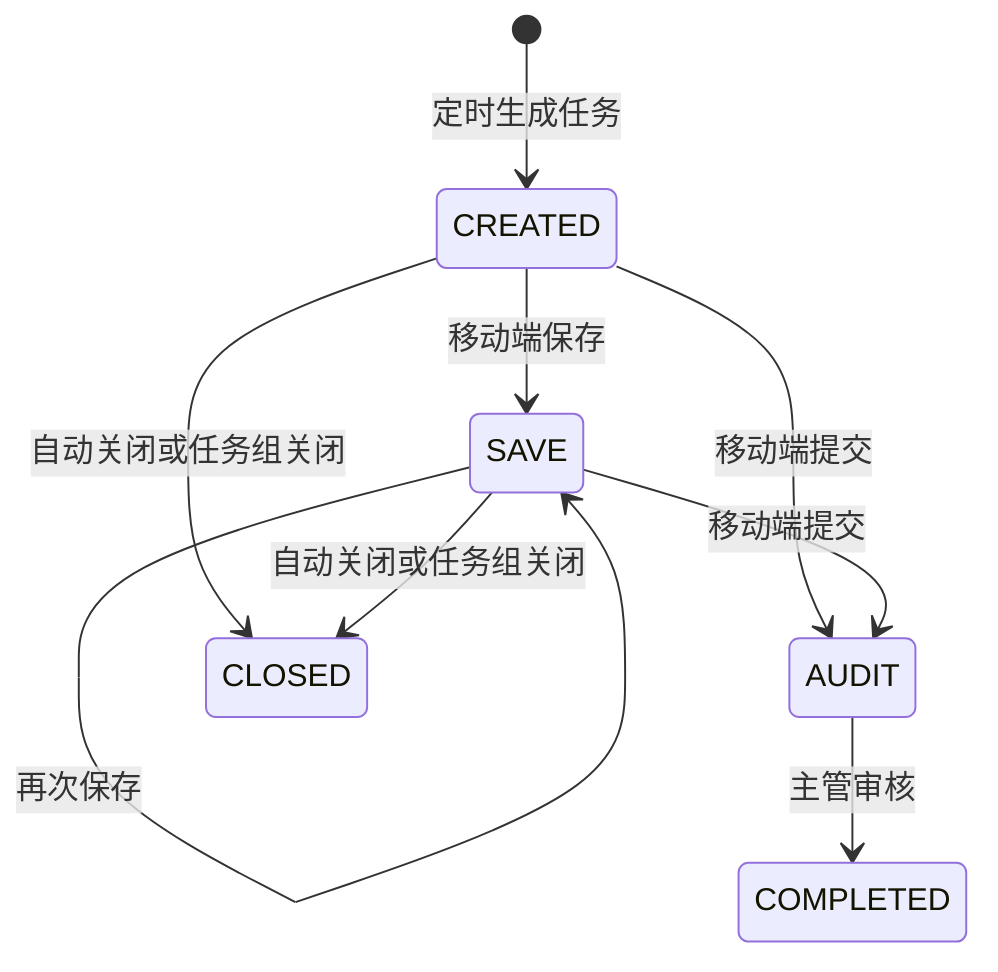
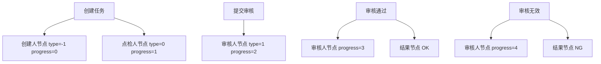

# 5S点检模块设计文档

## 1. 文档目的

本文面向交接使用，以当前代码实现为准，说明 5S 点检模块的职责边界、核心数据表、底表维护、任务生成、移动端提交、主管审核、通知待办、自动关闭、统计口径和维护注意事项。

当前代码中“5S 点检”使用 `5s` 类型标识，对应移动端地址 `https://mas.minthgroup.com/m/#/audit/5s/`。它复用 taskflow 的任务组、审批节点、待办通知、自动审核提醒、自动关闭和驱动任务统计能力；5S 自身的核心逻辑集中在“人员配置 + 出勤/上岗校验 + 底表区域配置 + 填写扣分 + 主管审核”。

## 2. 模块边界

### 2.1 主要代码位置

| 类型 | 路径 | 说明 |
| --- | --- | --- |
| 定时入口 | `dap-biz/src/main/java/com/minthgroup/ees/dap/controller/taskflow/TimingTaskFlowController.java` | 触发 5S 任务生成、人员同步、自动审核提醒、自动关闭、提交补偿、结束前提醒 |
| 底表接口 | `dap-biz/src/main/java/com/minthgroup/ees/dap/controller/taskflow/Base5sController.java` | 5S 底表分页、新增、修改、删除、导入、导出、区域列表 |
| 任务接口 | `dap-biz/src/main/java/com/minthgroup/ees/dap/controller/taskflow/Task5sController.java` | 5S 任务分页、详情、保存、提交、审核、删除、导出 |
| 底表服务 | `dap-biz/src/main/java/com/minthgroup/ees/dap/service/impl/taskflow/Base5sServiceImpl.java` | 底表版本、启停、导入批量保存、区域查询 |
| 任务服务 | `dap-biz/src/main/java/com/minthgroup/ees/dap/service/impl/taskflow/Task5sServiceImpl.java` | 任务生成、提交、审核、扣分统计、补偿提交 |
| 底表导入监听器 | `dap-biz/src/main/java/com/minthgroup/ees/dap/listener/T5sImportListener.java` | Excel 导入 5S 底表，处理区域列合并单元格 |
| 任务实体 | `dap-api/src/main/java/com/minthgroup/ees/dap/entity/taskflow/Task5sEntity.java` | 表 `c_yida_5s` 映射 |
| 底表实体 | `dap-api/src/main/java/com/minthgroup/ees/dap/entity/taskflow/Base5sEntity.java` | 表 `c_taskflow_base_5s` 映射 |
| 子表实体 | `dap-api/src/main/java/com/minthgroup/ees/dap/entity/taskflow/CommonSubformEntity.java` | 点检项、结果、图片、扣分等 JSON 子项 |
| Mapper | `dap-biz/src/main/java/com/minthgroup/ees/dap/mapper/taskflow/Task5sMapper.java` | 5S 驱动任务统计 SQL |
| 驱动统计 | `dap-biz/src/main/java/com/minthgroup/ees/dap/handler/driveTask/T5sDriveTaskStatistic.java` | 5S 任务进入驱动任务统计体系 |

### 2.2 主要外部依赖

| 依赖 | 用途 |
| --- | --- |
| `BaseUserService` | 读取 5S 人员配置、角色、频率和审核人配置 |
| `SyncEmpMapper` | 查询员工主岗、上级主管、部门经理、组织信息 |
| `AttendanceUtils` | 查询排班、出勤、请假和班次 |
| `OndutyMesService` | 对作业员按 MES 上岗记录判断是否生成点检 |
| `BaseExcludeDateConfigService` | 判断指定人员在指定日期是否需要生成 5S 任务 |
| `TaskGroupService` | 创建/关闭点检待办和审核待办，支持转派、撤销、自动关闭 |
| `ApprovedService` | 创建和更新审批进度节点 |
| `SendNoticeService` | 发送钉钉通知、EES 个人待办、取消待办、刷新待办进度 |
| `BaseFactoryService` | 获取工厂班次配置，返回给移动端详情 |
| `AreaSiteService` | 按工厂代码获取工厂名称 |
| `AutoAuditNoticeService` | 统一处理自动审核、提醒、关闭、结束前提醒 |

## 3. 核心数据模型

### 3.1 5S 任务表 `c_yida_5s`

实体：`Task5sEntity`

这是 5S 点检任务实例表。当前 EES 生成的数据统一写入 `data_source = '02'`，历史宜搭数据可能仍然存在，但生成、统计和多数查询都以 `data_source = '02'` 为准。

| 字段 | 含义 |
| --- | --- |
| `five_s_id` | 任务主键 |
| `five_s_uuid` | 任务组 UUID，任务待办、审核待办和移动端详情都使用该值关联 |
| `datefield_m4jlurzm` | 任务创建/推送时间，代码使用 UTC 当前时间 |
| `employeeField_m4jlurzn` / `textField_m4nkmm92` | 点检人姓名 / 工号 |
| `textField_m4nmmu3e` / `textField_m4ul1l0p` | 工厂名称 / 工厂代码 |
| `department` / `departmentSelectField_m4scvnbk` | 部门编码 / 部门名称 |
| `classroom` / `textField_m4nkmm93` | 课室编码 / 课室名称 |
| `regional` / `regional_desc` | 5S 区域编码 / 区域描述 |
| `job_level` / `job_name` | 职务等级 / 职务描述 |
| `selectField_m4tlkqdr` | 班次，代码中 `0` 为白班，`1` 为中班，`2` 为夜班 |
| `datefield_m4tlkqds` | 班次日期，生成时或提交保存时写入 |
| `subform_id` | 关联的底表配置 ID |
| `tablefield_m50leke2` | 点检项快照，JSON，元素为 `CommonSubformEntity` |
| `selectField_m4jlurzy` | 结果确认 |
| `textField_m4jlus00` | 异常描述 |
| `imageField_m4jlurzz` | 检查图片上传，JSON |
| `approved` | 审批意见，`1` 同意，`0` 无效 |
| `selectField_m4w5shlc` | 主管审批意见 |
| `textfield_m4xw4v51` | 意见描述 |
| `approved_user_id` | 审核人工号 |
| `approved_result` | 审批结果，提交时写 `SUBMIT` |
| `instance_status` | 实例状态：`CREATED`、`SAVE`、`AUDIT`、`COMPLETED`、`CLOSED` 等 |
| `time_out_status` | 超时状态，`1` 表示超时扣分 |
| `data_source` | 数据来源，EES 生成为 `02` |
| `sum_score` | 累计扣分，提交/保存时最大限制为 10 |

### 3.2 5S 底表 `c_taskflow_base_5s`

实体：`Base5sEntity`

底表按“工厂 + 区域描述”维护版本。一个区域配置下保存一组检查项，检查项存在 `subform` JSON 字段中。

| 字段 | 含义 |
| --- | --- |
| `id` | 底表主键 |
| `site` / `site_name` | 工厂代码 / 工厂名称 |
| `department` / `department_name` | 部门编码 / 部门名称，当前导入逻辑主要按区域分组，部门字段不作为版本唯一键 |
| `regional` / `regional_desc` | 区域编码 / 区域描述 |
| `subform` | 点检项列表，JSON，元素为 `CommonSubformEntity` |
| `version` | 版本号 |
| `enable` | 是否启用，`1` 启用，`0` 禁用 |

### 3.3 点检项 `CommonSubformEntity`

`CommonSubformEntity` 同时用于 5S 底表和任务快照。

| 字段 | 含义 |
| --- | --- |
| `item` | 项目 |
| `content` | 检查内容 |
| `needPhotograph` | 是否需要拍照，默认 `N` |
| `referImg` | 参考图片 |
| `image` | 实际上传图片，JSON |
| `score` | 扣分分值 |
| `result` | 检查结果，枚举 `OK` / `NG` |
| `ngInfolist` | NG 信息列表，当前 5S 主流程未单独转异常闭环 |

### 3.4 通用 taskflow 表

5S 复用通用 taskflow 表：

| 表/实体 | 用途 |
| --- | --- |
| `TaskGroupEntity` | 待办任务组。点检待办 `type=0`，审核待办 `type=1`，`checkType=5s` |
| `ApprovedEntity` | 审批节点。创建任务时写创建人节点和点检人节点；提交审核时写主管节点；审核后写 OK/NG 结果节点 |
| `BaseUserEntity` | 5S 人员配置，包含人员角色、频率、工厂等 |
| `NoticeRecord` | EES 个人待办和通知记录，5S 使用 `NoticeRecordTypeEnum.B02` |

## 4. 枚举和编码

| 枚举/常量 | 代码值 | 含义 |
| --- | --- | --- |
| `TypeEnum.T5S` | `5s` | 5S 点检业务类型 |
| `TypeNoticeUrlEnum.T5S` | `https://mas.minthgroup.com/m/#/audit/5s/` | 移动端详情地址前缀 |
| `DriveTaskTypeEnum.T_5s` | `5s` | 驱动任务统计类型 |
| `CheckRoleEnum.RC` | `C` | 普通点检人 |
| `CheckRoleEnum.R0` | `0` | 班线长点检人 |
| `CheckRoleEnum.RA` | `A` | 课长点检人 |
| `CheckRoleEnum.RB` | `B` | 经理点检人 |
| `FrequencyEnum.F01` | 一周一次 | 按周去重 |
| `FrequencyEnum.F02` | 一班一次 | 枚举存在，但 5S 当前生成逻辑没有专门按班次窗口处理 |
| `FrequencyEnum.F03` | 一日一次 | 按当天去重 |
| `FrequencyEnum.F04` | 两周一次 | 按近 14 天窗口去重 |
| `JobLevelEnum.L10` | `10` | 线长 |
| `JobLevelEnum.L11` | `11` | 班组长 |
| `JobLevelEnum.L20` | `20` | 课长 |
| `JobLevelEnum.L30` | `30` | 经理 |
| `InstanceStatusEnum.CREATED` | `CREATED` | 已创建，待点检 |
| `InstanceStatusEnum.SAVE` | `SAVE` | 已保存，未提交 |
| `InstanceStatusEnum.AUDIT` | `AUDIT` | 审核中 |
| `InstanceStatusEnum.COMPLETED` | `COMPLETED` | 已完成 |
| `InstanceStatusEnum.CLOSED` | `CLOSED` | 已关闭 |

## 5. 底表维护

### 5.1 页面接口

| 接口 | 方法 | 说明 |
| --- | --- | --- |
| `/base/5s/page` | `POST` | 分页查询底表，默认按 `site`、`department`、`version desc` 排序 |
| `/base/5s/regionalList` | `GET` | 查询启用区域列表，支持按工厂、部门和区域描述过滤 |
| `/base/5s/relList` | `GET` | 查询某个底表 ID 下的 `subform` 明细 |
| `/base/5s` | `POST` | 新增底表，版本设置为 1 |
| `/base/5s` | `PUT` | 修改底表，旧版本禁用，新插入一条新版本 |
| `/base/5s` | `DELETE` | 删除底表；若删除启用版本，会自动启用同工厂同区域下剩余最高版本 |
| `/base/5s/import` | `POST` | 导入 Excel 底表 |
| `/base/5s/import/template` | `GET` | 下载导入模板 |
| `/base/5s/export` | `POST` | 导出底表，将主表字段和 `subform` 明细拆成多行 |
| `/base/5s/dealData` | `POST` | 历史数据修正：按区域描述补区域编码 |

### 5.2 新增、修改和删除规则

新增时，`Base5sController#save` 先把 `version` 设为 1，再调用 `Base5sServiceImpl#save5s`。服务按 `site + regionalDesc + enable=1` 检查是否已有启用配置；已有则抛出“该配置已经存在”。

修改不是原地覆盖。`Base5sServiceImpl#update5s` 会读取旧记录，把新记录版本号设为旧版本 `+1`，将旧记录 `enable` 改为 `0`，再把新记录作为新 ID 保存，`enable=1`。

删除时，`removeBase` 会删除指定 ID。如果删除的是启用版本，则按 `site + regionalDesc` 查剩余记录中版本号最大的记录并自动启用。

### 5.3 导入规则

导入入口为 `Base5sController#importExcel`，读取 `site`，再通过 `OrganizationService#getSiteNameBySite` 获取工厂名称。Excel 使用 `T5sImportListener` 解析，表头行数为 1。

导入时的实际处理规则：

1. 如果一行的 `item` 和 `content` 都为空，则跳过。
2. 导入强制写入当前请求的 `site` 和 `siteName`。
3. 监听器只处理第一列的合并单元格，用合并区域首行的区域描述填充合并区域内后续行。
4. 按 `regionalDesc` 分组生成底表主记录。
5. 区域编码通过 `Area5sEnum.getCodeByDesc(regionalDesc)` 映射。映射表支持中文、英文和塞尔维亚语等描述；如果描述不在映射表中，`regional` 会为空。
6. 每一行生成一个 `CommonSubformEntity`，写入 `item`、`content`、`score`。
7. 每个区域保存前查询 `site + regionalDesc` 的最新版本，新版本为最新版本 `+1`，没有历史版本则为 1。
8. `saveConfigBatch` 保存前会把同 `site + regionalDesc` 的当前启用记录全部置为 `enable=0`，再保存新版本并启用。

## 6. 任务生成

### 6.1 定时入口

5S 任务有两个生成入口。

| 接口 | 方法 | 用途 |
| --- | --- | --- |
| `/timing/taskflow/5s` | `GET` | 生成普通点检人和班线长任务，内部调用 `createTaskV1` |
| `/timing/taskflow/5s/{jobLevel}` | `GET` | 生成指定职务层级任务，当前只处理 `L20` 课长和 `L30` 经理 |

两个入口都会先检查当前环境的 `bbuSites`。只有 `2871`、`2081`、包含 `2071`、`2881`、包含 `2951`、包含 `3271`、包含 `2075` 时才执行，否则直接返回成功但不生成任务。

入口使用 Redis 锁防重：

| 入口 | 锁 key |
| --- | --- |
| `/5s` | `taskFlow:5s:{bbuSites}:{cycleDate}` |
| `/5s/{jobLevel}` | `taskFlow:5s:{jobLevel.code}:{bbuSites}:{cycleDate}` |

### 6.2 普通点检人和班线长生成逻辑

入口：`Task5sServiceImpl#createTaskV1`

`createTaskV1` 会依次调用：

1. `createTaskByRole(site, cycleDate, CheckRoleEnum.RC, ...)`
2. `createTaskByRole(site, cycleDate, CheckRoleEnum.R0, ...)`

`createTaskByRole` 的主要规则：

1. 从 `BaseUserService#listUserByRole(site, "5s", role)` 读取人员配置。
2. 对每个配置人员按 `isCreated(cycleDate, userId, frequency)` 判断频率窗口内是否已经创建过 EES 任务；已创建则跳过。
3. 通过 `SyncEmpMapper#listEmpMainJobByUserId` 查询主岗员工信息。
4. 调用 `BaseExcludeDateConfigService#isExecute` 判断排除日配置；不执行则跳过。
5. 如果岗位名包含“作业员”且角色是 `RC`，必须存在 MES 上岗记录，查询方法为 `OndutyMesService#listByUserId`；没有上岗则不生成。
6. 非上述作业员路径，则先查排班 `AttendanceUtils.getShiftListV1`，无排班跳过；再查当天出勤数据，无出勤或有请假也跳过。
7. 通过校验后调用 `buildDayInstance` 创建任务。

`isCreated` 的去重窗口：

| 频率 | 去重窗口 |
| --- | --- |
| `F01` | 当前周周一 00:00:00 到周日 23:59:59 |
| `F03` | 当天 00:00:00 到 23:59:59 |
| `F04` | 当前代码把开始和结束都落在 `cycleDate.minusDays(13)` 当天，这是一个需要注意的实现细节 |
| 其他 | 默认当天 |

查询条件为 `textField_m4nkmm92 = userId`、`datefield_m4jlurzm` 落在窗口内、`data_source = '02'`。

### 6.3 课长和经理生成逻辑

入口：`Task5sServiceImpl#createTask`

`/timing/taskflow/5s/{jobLevel}` 当前只对 `L20` 和 `L30` 生效。

| `jobLevel` | 读取人员角色 | 说明 |
| --- | --- | --- |
| `L20` | `CheckRoleEnum.RA` | 课长点检人 |
| `L30` | `CheckRoleEnum.RB` | 经理点检人 |

生成规则：

1. 从 `BaseUserService#listUserByRole(site, "5s", role)` 读取配置人员，同时记录人员频率。
2. 通过 `SyncEmpMapper#listEmpMainJobByUserId` 查询主岗信息。
3. 同一工号只处理一次。
4. 调用 `BaseExcludeDateConfigService#isExecute` 判断是否执行。
5. 必须有当天排班 `AttendanceUtils.getShiftListV1`，否则不生成。
6. 调用 `createTaskByJobV1` 按频率窗口去重并创建任务。

`createTaskByJobV1` 的去重窗口：

| 频率 | 去重窗口 |
| --- | --- |
| `F01` | 当前周周一到周日 |
| `F03` | 当天 |
| `F04` | `cycleDate.minusDays(13)` 到 `cycleDate`，即包含当天的近 14 天 |
| 其他 | 默认当天 |

没有历史任务时调用 `buildWeekInstance`。课长任务计划完成时间为推送后 7 天的当天最大时间；经理任务为推送后 14 天的当天最大时间。

### 6.4 日任务实例创建

方法：`buildDayInstance`

创建内容：

1. 生成 `fiveSUuid`。
2. 写入点检人、工号、工厂、部门、课室、班次日期、岗位等信息。
3. 工厂名称优先使用 `AreaSiteService#querySiteName`，否则使用员工二级部门描述。
4. 岗位名包含“线长”则写 `jobLevel=10`，包含“组长”则写 `jobLevel=11`，包含“经理”则写 `jobLevel=30`。
5. 状态写 `CREATED`，`dataSource=02`。
6. 班次通过 `getShiftScheduleInfo` 转换：排班为 `ShiftEnum.S1202` 时写 `0`，其他写 `2`。当前代码不会在这里写中班 `1`。
7. 保存 `Task5sEntity`。
8. 创建点检待办 `TaskGroupEntity`，`checkType=5s`，标题为 `Check_Name_5s`，计划完成时间为推送后 24 小时。
9. 创建审批节点：创建人节点 `type=-1, progress=0`，点检人节点 `type=0, progress=1`。
10. 如果 `isNotice=true`，发送 EES 个人待办，类型为 `NoticeRecordTypeEnum.B02`。

### 6.5 周期任务实例创建

方法：`buildWeekInstance`

用于课长和经理类任务。与日任务相比，主要差异是：

1. 不写 `datefieldM4tlkqds` 班次日期，后续移动端保存/提交时如果任务原来没有班次日期，会写当前时间或前端传入日期。
2. 岗位名包含“课长”写 `jobLevel=20`；包含“经理”写 `jobLevel=30`。
3. 不写班次。
4. 计划完成时间按岗位不同设置：课长 7 天，经理 14 天。
5. EES 待办发送前会把计划完成时间减 8 小时再传给 `sendNoticeService.send`。

## 7. 移动端任务详情

接口：`GET /taskflow/5s/list/{uuid}`

实现：`Task5sServiceImpl#listTaskByUuid`

查询逻辑：

1. 先通过 `TaskGroupService#getTaskByUuid` 查询任务组。
2. 查询 `c_yida_5s` 中 `fiveSUuid = uuid` 且 `dataSource = '02'` 的任务，按 `fiveSId desc` 排序。
3. 如果有任务，则通过 `BaseFactoryService#getShiftConfig(site)` 获取工厂班次配置并返回给前端。
4. 返回 `Task5sVo`，其中 `formData` 来自任务表 `tablefieldM50leke2`。
5. 部门和课室名称会通过 `SiteLangUtil.renderDeptName` 做多语言渲染。
6. 任务名取任务组 `checkName`，任务描述使用任务组发起人和一级部门描述。

注意：5S 点检任务创建时没有从 `Base5sEntity` 自动带入底表明细。移动端通常需要通过底表区域接口选择区域和关联明细，然后保存/提交到任务的 `formData`。

## 8. 保存和提交

### 8.1 保存草稿

接口：`POST /taskflow/5s/save`

实现：`Task5sServiceImpl#save5s`

保存规则：

1. `fiveSId` 不能为空。
2. 任务必须存在。
3. 任务状态不能是 `CLOSED`。
4. 将 DTO 字段复制到实体，`instanceStatus` 写 `SAVE`。
5. `formData` 写入任务表 `tablefieldM50leke2`。
6. `sumScore` 如果大于 10，则按 10 保存。
7. 如果原任务已有 `datefieldM4tlkqds`，则本次更新不允许覆盖该字段。
8. 如果原任务没有 `datefieldM4tlkqds`，前端未传则写 UTC 当前时间；前端传入则清除时分秒，只保留日期。

### 8.2 提交审核

接口：`POST /taskflow/5s/submit`

实现：`Task5sServiceImpl#submit`

提交规则：

1. `fiveSId` 不能为空。
2. 任务必须存在。
3. 任务状态不能是 `CLOSED`。
4. 将 DTO 字段复制到实体，`instanceStatus` 写 `AUDIT`。
5. `formData` 写入任务表 `tablefieldM50leke2`。
6. `approvedResult` 写 `SUBMIT`。
7. 调用 `sendApproved` 查找审核人并创建审核节点。
8. 关闭点检待办：`taskGroupService.updateStatus(uuid, null, "1")`。
9. 写入 `approvedUserId`。
10. `sumScore` 最高限制为 10。
11. 班次日期处理规则与保存一致。
12. 如果找到审核人，则创建审核待办并发送钉钉通知。
13. 最后调用 `sendNoticeService.sendDemandProgressByUuid(uuid)` 刷新待办进度。

### 8.3 审核人选择

方法：`sendApproved`

审核人选择规则：

1. 如果点检人岗位名包含“经理”：
   - 工厂 `2081` 固定审核人 `10070338`。
   - 工厂 `2881` 固定审核人 `16096`。
   - 工厂 `2075` 固定审核人 `10061113`。
   - 其他工厂使用 `BaseUserService#getAuditBySite(site, TypeEnum.T5S)` 查询配置审核人。
2. 如果点检人不是经理：
   - 先查点检人的上级，再查上级的上级，作为审核人。
   - 如果没查到，则按部门描述查询岗位名包含“经理”的人员，取第一位。
   - 如果仍然没有，则返回 `null`。

找到审核人后会保存 `ApprovedEntity`，`type=1`、`progress=2`，并返回审核人工号。

## 9. 主管审核

### 9.1 单任务审核

接口：`POST /taskflow/5s/audit`

入参为 `List<AuditTaskDto>`。实现：`Task5sServiceImpl#auditTask`

审核规则：

1. 每条审核入参必须能找到任务和对应审核人的审批节点。
2. `approved=0` 时审批节点进度写 `4`，结果节点写 `NG`。
3. `approved=1` 时审批节点进度写 `3`，结果节点写 `OK`。
4. 保存一条审核结果节点，`type=1`。
5. 更新任务表：`approved`、`selectfieldM4w5shlc`，`instanceStatus=COMPLETED`。
6. 所有入参处理完成后，调用 `taskGroupService.updateAuditStatus(uuid, "1")` 将审核待办置为已办。

### 9.2 批量审核

接口：`POST /taskflow/5s/batch/audit`

实现位于 `Task5sController`。入参包含：

| 字段 | 说明 |
| --- | --- |
| `userId` | 审核人工号，不传则取当前登录用户 |
| `approved` | 审核结果，不传默认 `1` |
| `uuids` | 任务组 UUID 列表 |

批量审核按 UUID 去重后逐个处理。每个 UUID 会查出组内全部 5S 任务，要求任务状态必须是 `AUDIT`，否则抛错。然后组装 `AuditTaskDto` 调用服务层审核。

## 10. 删除和修改

任务后台支持直接修改和删除：

| 接口 | 方法 | 说明 |
| --- | --- | --- |
| `/taskflow/5s` | `POST` | 按 ID 更新任务实体 |
| `/taskflow/5s` | `DELETE` | 删除任务 |

删除规则：

1. 入参为空直接返回成功。
2. 如果任务不存在则跳过。
3. `AUDIT` 或 `COMPLETED` 状态不能删除。
4. 删除任务后，如果同 UUID 下没有剩余任务，则删除任务组，并调用 `sendNoticeService.cancelDemandProgressByUuid(uuid)` 取消 EES 待办。

## 11. 导出和后台查询

### 11.1 后台分页

接口：`POST /taskflow/5s/page`

处理规则：

1. 默认按 `fiveSId desc` 排序。
2. 前端过滤字段 `shift` 会转换成数据库字段 `selectfieldM4tlkqdr`，`D/M/N` 分别转换成 `0/1/2`。
3. `datefieldM4jlurzm` 日期范围会补齐为当天 `00:00:00` 到 `23:59:59`。
4. 返回前会把班次、部门、课室、审核人工号名称做渲染。

### 11.2 导出

接口：`POST /taskflow/5s/export`

导出两个 sheet：

1. “点检”：任务主数据。
2. “明细”：按 `tablefieldM50leke2` 拆出的检查项明细。

导出时会处理：

1. 抽查时机和班次多语言描述。
2. 实例状态描述。
3. 审批意见 `0/1` 多语言描述。
4. `datefieldM4jlurzm` 按 `local.time-zone` 增加时区小时数。
5. 明细结果输出 `OK` / `NG`。

## 12. 自动任务和补偿

5S 复用 `TimingTaskFlowController` 中的通用自动任务：

| 接口 | 说明 |
| --- | --- |
| `GET /timing/taskflow/sync/task/user` | 同步 DDS、SOP、5S、EQU 等任务人员清单 |
| `GET /timing/taskflow/auto/audit` | 自动审核，包含 5S |
| `GET /timing/taskflow/auto/warning` | 自动提醒，包含 DDS 和 5S |
| `GET /timing/taskflow/auto/close` | 自动关闭超时未完成任务，包含 5S |
| `GET /timing/taskflow/submit/compensations` | 处理提交审核但没有审核人的任务，包含 5S |
| `GET /timing/taskflow/notifyBeforeShutdown` | 任务结束前提醒，包含 5S |

5S 的提交补偿逻辑在 `Task5sServiceImpl#submitCompensations`：

1. 查询 `cycleDate.minusDays(1)` 到 `cycleDate` 范围内的任务。
2. 条件为 `instanceStatus = AUDIT` 且 `approvedUserId is null`。
3. 将任务复制为 `Task5sDto` 后重新调用 `submit`，尝试补建审核人、审核节点和审核待办。

## 13. 绩效/非标扣分口径

实现：`Task5sServiceImpl#listByUserId`

查询维度：

1. 按 `datefieldM4tlkqds` 查询指定 `cycleDate` 当天。
2. 按点检人工号 `textField_m4nkmm92` 过滤。

已完成扣分任务：

1. 条件：`sumScore > 0` 且 `approved = '1'`。
2. 总分按负数累计：`score = -sumScore`。
3. 明细只取 `formData` 中 `result = NG` 的项，输出项目、检查内容、结果和分值。

未做任务：

1. 查询当天 `instanceStatus = CLOSED` 的任务。
2. 每条关闭任务按 `-5` 计分。

返回值为 `NonStandardResult`，包含总扣分和非标明细列表。

## 14. 驱动任务统计口径

实现：`T5sDriveTaskStatistic` 和 `Task5sMapper`

| 统计项 | SQL 条件 |
| --- | --- |
| 任务总数 | `datefield_m4jlurzm like queryCycleDate` 且 `data_source = '02'` |
| 完成数 | 总数条件 + `instance_status = 'COMPLETED'` |
| 准时完成数 | 完成数条件 + `(time_out_status != '1' or time_out_status is null)` |

分组维度：

1. 工厂代码、工厂名称。
2. 部门编码、部门名称。
3. 点检人工号、姓名。
4. 课室编码、课室名称。

如果统计结果中有课室但没有部门，`T5sDriveTaskStatistic` 会通过 `SyncEmpMapper#getDeptid3ListBySiteAndDeptid4` 回填部门编码和部门名称。总数统计还会调用 `getSiteName` 修正工厂名称。

注意：驱动任务统计使用任务创建时间 `datefield_m4jlurzm`，不是班次日期 `datefield_m4tlkqds`。

## 15. 状态流转

审批节点同步流转：

## 16. 常见排查路径

### 16.1 为什么没有生成 5S 任务

按以下顺序排查：

1. 当前 `bbuSites` 是否在 5S 允许生成的工厂范围内。
2. 调用的是 `/timing/taskflow/5s` 还是 `/timing/taskflow/5s/{jobLevel}`；后者只处理 `L20` 和 `L30`。
3. `BaseUserService#listUserByRole(site, "5s", role)` 是否有人员配置。
4. 频率窗口内是否已存在 `data_source='02'` 的任务。
5. 人员主岗是否能通过 `SyncEmpMapper#listEmpMainJobByUserId` 查到。
6. 排除日配置 `BaseExcludeDateConfigService#isExecute` 是否返回执行。
7. 作业员是否有 MES 上岗记录。
8. 非作业员是否有排班、出勤，且没有请假。
9. Redis 锁是否仍未释放或同一任务仍在执行。

### 16.2 为什么提交后没有审核待办

重点检查：

1. 任务是否已进入 `AUDIT`。
2. `sendApproved` 是否找到审核人。
3. 经理岗位是否命中特殊工厂固定审核人逻辑。
4. 非经理岗位是否能查到上级的上级。
5. 部门经理兜底查询是否能按部门描述和岗位名查到人员。
6. `approved_user_id` 是否为空；为空可通过 `/timing/taskflow/submit/compensations` 触发补偿。
7. `TaskGroupEntity` 是否创建了 `type=1` 的审核待办。

### 16.3 为什么驱动任务统计和班次日期对不上

5S 驱动任务统计按 `datefield_m4jlurzm` 创建时间统计，绩效/非标扣分按 `datefield_m4tlkqds` 班次日期统计。两个字段的口径不同，排查统计差异时需要先确认使用的是哪个日期字段。

### 16.4 为什么扣分最多只有 10 分

`save5s` 和 `submit` 都会限制 `sumScore`，如果前端传入值大于 10，服务端保存为 10。这是当前代码实现，不依赖底表分值合计。

## 17. 维护注意事项

1. 5S 类型标识固定为 `5s`，移动端 URL 前缀固定在 `TypeNoticeUrlEnum.T5S`。
2. EES 生成任务使用 `data_source='02'`，统计和查询不要漏掉该条件。
3. 底表版本唯一维度是 `site + regionalDesc`，不是 `site + department + regional`。
4. 底表导入依赖区域描述映射，新增语言或区域名称时要同步维护 `Area5sEnum.DESC_MAP`。
5. 任务创建时不会自动把底表 `subform` 写入任务表，任务明细来自移动端保存/提交的 `formData`。
6. 普通作业员走 MES 上岗校验，非作业员走排班、出勤和请假校验。
7. 日任务班次映射只有白班 `0` 和夜班 `2` 两种写法；中班 `1` 虽然在页面和导出里支持，但当前创建逻辑不会自动写入。
8. `isCreated` 中 `F04` 的窗口实现与 `createTaskByJobV1` 不一致：普通/班线长路径的 `F04` 只查 `cycleDate.minusDays(13)` 当天；课长/经理路径查近 14 天。
9. 经理审核人存在工厂硬编码：`2081 -> 10070338`，`2881 -> 16096`，`2075 -> 10061113`。
10. 审核通过后 5S 不会像 DDS 或设备点检那样创建异常处理流程；NG 和扣分主要用于导出、非标扣分和统计。
11. 自动关闭由通用 `AutoAuditNoticeService` 处理，任务组关闭 5S 时会把同 UUID 的 `c_yida_5s.instance_status` 更新为 `CLOSED`。
12. 驱动任务统计按创建时间，不按班次日期。

