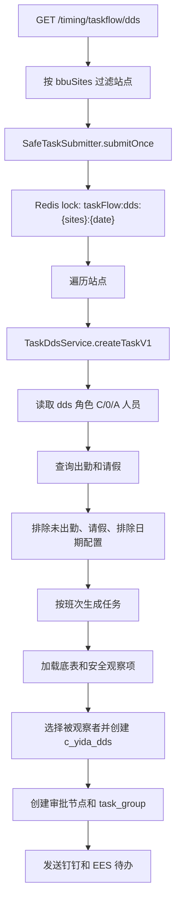
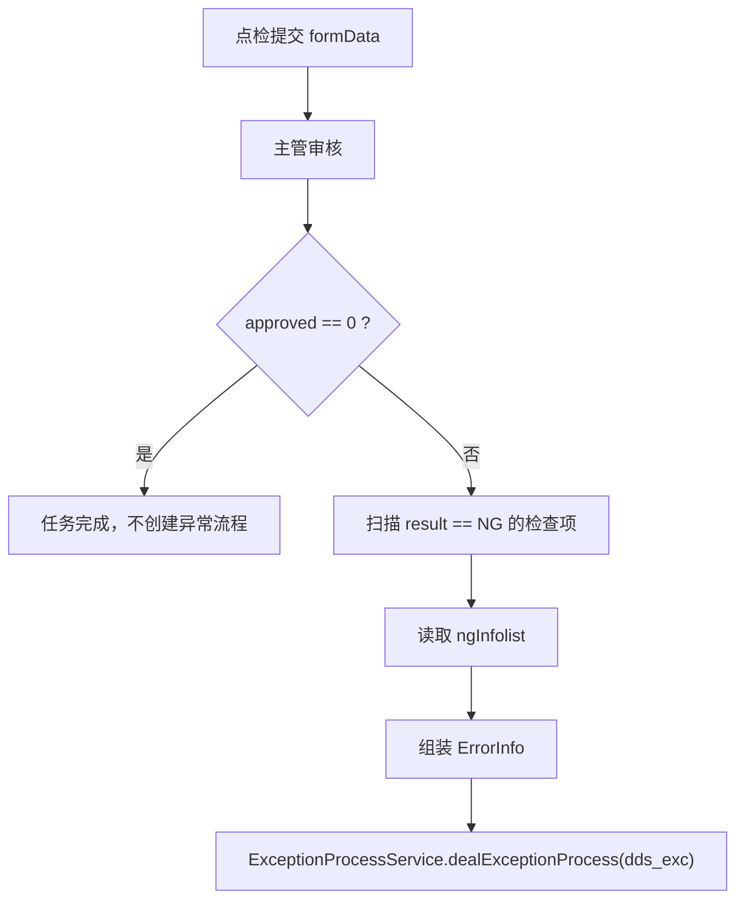

# 安全点检模块设计文档

## 1. 文档目的

本文面向交接使用，以当前代码实现为准，说明安全点检模块的职责边界、核心数据表、任务生成逻辑、提交审核流程、异常处理、通知待办、统计口径和维护注意事项。

当前代码中“安全点检”主要使用 `dds` 类型标识，对应 DDS 点检表。它不是单一接口，而是一组围绕底表配置、人员配置、定时生成、移动端填写、主管审核、自动提醒关闭和驱动任务统计的流程。

## 2. 模块边界

### 2.1 主要代码位置

| 类型 | 路径 | 说明 |
| --- | --- | --- |
| 定时入口 | `dap-biz/src/main/java/com/minthgroup/ees/dap/controller/taskflow/TimingTaskFlowController.java` | 触发 DDS 任务、经理/工厂总任务、被观察计数、自动审核、提醒、关闭 |
| 任务接口 | `dap-biz/src/main/java/com/minthgroup/ees/dap/controller/taskflow/TaskDdsController.java` | 查询、保存、提交、审核、导出、历史数据修正 |
| 任务服务 | `dap-biz/src/main/java/com/minthgroup/ees/dap/service/impl/taskflow/TaskDdsServiceImpl.java` | 安全点检核心业务逻辑 |
| 任务服务接口 | `dap-biz/src/main/java/com/minthgroup/ees/dap/service/taskflow/TaskDdsService.java` | DDS 服务契约 |
| 点检底表维护 | `BaseDdsController.java` / `BaseDdsServiceImpl.java` | 安全十大红线底表的增删改查、导入导出、版本启停 |
| 安全观察底表维护 | `BaseDdsObserveController.java` / `BaseDdsObserveServiceImpl.java` | 安全观察项的增删改查、导入导出、版本启停 |
| 底表导入监听器 | `DdsImportListener.java` | Excel 导入安全点检底表 |
| 安全观察导入监听器 | `DdsRedLineImportListener.java` | Excel 导入安全观察项 |
| 任务实体 | `TaskDdsEntity.java` | 表 `c_yida_dds` 映射 |
| 点检底表实体 | `BaseDdsEntity.java` | 表 `c_taskflow_base_dds` 映射 |
| 安全观察实体 | `BaseDdsObserveEntity.java` | 表 `c_taskflow_base_dds_observe` 映射 |
| 任务统计器 | `DdsDriveTaskStatistic.java` | DDS 任务进入驱动任务统计体系 |
| Mapper | `TaskDdsMapper.java` | DDS 任务查询和统计 SQL |

### 2.2 外部依赖

| 依赖 | 用途 |
| --- | --- |
| `BaseUserService` | 读取安全点检人员配置，角色包括点检人、班线长、课长、经理、管理员、工厂总等 |
| `AttendanceUtils` | 查询排班、班次、出勤和请假信息 |
| `UserCountService` | 维护被观察者月度计数，任务生成时选择被观察次数较少的人 |
| `TaskGroupService` | 创建和维护任务组、待办状态、审核状态、超时关闭状态 |
| `ApprovedService` | 创建和更新审批流节点 |
| `SendNoticeService` | 发送钉钉通知、EES 个人待办、取消待办、刷新待办进度 |
| `ExceptionProcessService` | 审核通过后，将 NG 检查项转为 `dds_exc` 异常处理流程 |
| `SyncEmpMapper` / `HcmService` | 查询组织、员工、上级主管、部门和课室信息 |
| `BaseExcludeDateConfigService` | 判断指定人员在指定日期是否需要生成任务 |

## 3. 核心数据模型

### 3.1 安全点检任务表 `c_yida_dds`

实体：`TaskDdsEntity`

这是安全点检任务实例表。代码同时兼容历史宜搭数据，但当前 EES 生成的数据统一写入 `data_source = '02'`。

| 字段 | 含义 |
| --- | --- |
| `dds_id` | 任务主键 |
| `dds_uuid` | 任务组 UUID，同一次推送下的多条明细共享该值 |
| `dateField_m4v5wruv` | 班次日期，也是任务统计口径的周期日期 |
| `dateField_m53c4yhh` | 任务推送时间，代码使用 UTC 当前时间 |
| `employeeField_m4hx14po` / `textField_m4nmow9l` | 观察人姓名 / 工号 |
| `textField_m4nmow9m` / `textField_m4ul67zv` | 工厂名称 / 工厂代码 |
| `department` / `selectField_m4t9vox7` | 部门编号 / 部门名称 |
| `classroom` / `classroom_name` | 课室编号 / 课室名称 |
| `job_level` / `selectField_m4t7uetm` | 职务等级 / 职务描述 |
| `shift` / `selectField_m4v5wruu` | 班次编号 / 班次描述 |
| `employeeField_lwdgy8r3` / `textField_lwdgy8r4` | 被观察者姓名 / 工号 |
| `observe` | 安全观察项快照，JSON |
| `form_data` | 安全十大红线检查项快照，JSON |
| `approved` | 审批意见，`1` 同意，`0` 无效 |
| `confirm` / `selectField_lwgbusp5` | 异常确认，`0` 无异常，`1` 有异常 |
| `instance_status` | 实例状态：`CREATED`、`SAVE`、`AUDIT`、`COMPLETED`、`CLOSED` 等 |
| `time_out_status` | 超时状态，`1` 表示超时扣分 |
| `data_source` | 数据来源，`01` 宜搭，`02` EES |
| `sum_score` | 累计扣分，提交时最大限制为 10 |

### 3.2 安全点检底表 `c_taskflow_base_dds`

实体：`BaseDdsEntity`

这是“安全十大红线”模板表。任务生成时会把启用版本的 `subform` 拷贝到任务表 `formData`，形成任务快照。

| 字段 | 含义 |
| --- | --- |
| `site` / `site_name` | 工厂代码 / 工厂名称 |
| `department` / `department_name` | 部门编号 / 部门名称 |
| `classroom` / `classroom_name` | 课室编号 / 课室名称 |
| `subform` | 检查项列表，JSON，元素为 `CommonSubformEntity` |
| `version` | 版本号 |
| `enable` | 是否启用，`1` 启用，`0` 禁用 |

底表更新不是原地覆盖：`updateBaseDds` 会把旧记录置为 `enable = 0`，再插入一条新版本记录。删除启用版本时，如果存在旧版本，会自动启用版本号最大的旧记录。

### 3.3 安全观察底表 `c_taskflow_base_dds_observe`

实体：`BaseDdsObserveEntity`

这是安全观察项模板表。仅线长、组长、课长的任务生成会加载该底表，写入任务 `observe` 快照。

| 字段 | 含义 |
| --- | --- |
| `site` / `site_name` | 工厂代码 / 工厂名称 |
| `item` | 项目 |
| `content` | 检查内容 |
| `type` | 数据类型，`1` 文本，`2` 单选，`3` 复选，`4` 照片 |
| `candidate_value` | 候选值 |
| `note` | 说明 |
| `version` | 版本号 |
| `enable` | 是否启用 |

### 3.4 任务组和审批表

DDS 任务依赖通用 taskflow 表：

| 表/实体 | 用途 |
| --- | --- |
| `TaskGroupEntity` | 按 `uuid` 维护任务组、待办、推送时间、计划完成时间、审核状态 |
| `ApprovedEntity` | 维护审批节点。创建任务时写入创建人节点和点检人节点；提交审核时写入主管节点；审核后写入 OK/NG 结果节点 |

## 4. 枚举和关键编码

| 枚举 | 关键值 | 说明 |
| --- | --- | --- |
| `TypeEnum` | `DDS("dds")` | 安全点检类型 |
| `TypeEnum` | `DDS_EXC("dds_exc")` | 安全点检异常处理类型 |
| `JobLevelEnum` | `10` 线长，`11` 班组长，`20` 课长，`30` 经理，`40` 工厂总 | 任务生成和审核流分支依据 |
| `FrequencyEnum` | `F01` 一周一次，`F02` 一班一次，`F03` 一日一次，`F04` 两周一次 | 用户配置和计划完成时间计算依据 |
| `InstanceStatusEnum` | `CREATED`、`SAVE`、`AUDIT`、`COMPLETED`、`CLOSED` | 任务生命周期状态 |
| `TypeNoticeUrlEnum` | `DDS -> https://mas.minthgroup.com/m/#/audit/dds/` | 移动端任务 URL 前缀 |

## 5. 底表维护流程

### 5.1 安全十大红线底表

接口前缀：`/base/dds`

| 接口 | 方法 | 说明 |
| --- | --- | --- |
| `/page` | `POST` | 分页查询，默认按 `site`、`department`、`classroom`、`version desc` 排序 |
| `/` | `POST` | 新增底表。相同 `site + department + classroom` 已存在则报“配置已经存在！” |
| `/` | `PUT` | 修改底表。旧版本禁用，新版本插入 |
| `/` | `DELETE` | 删除底表。若删除启用版本，会回退启用最大旧版本 |
| `/import` | `POST` | Excel 导入，按部门和课室聚合多行检查项 |
| `/import/template` | `GET` | 导入模板 |
| `/export` | `POST` | 导出底表，按检查项拆行 |

导入逻辑：

1. `DdsImportListener` 按 `department + classroom` 聚合 Excel 行。
2. 每行生成一个 `CommonSubformEntity`，包含 `item`、`content`、`score`、`needPhotograph`。
3. 校验部门编号和课室编号是否存在。
4. 保存前读取最新版本号，新记录版本号为旧版本 + 1，没有旧版本则为 1。
5. `saveConfigBatch` 保存时先禁用同 `site + department + classroom` 的当前启用版本，再插入新版本。

### 5.2 安全观察底表

接口前缀：`/base/dds/red-line`

| 接口 | 方法 | 说明 |
| --- | --- | --- |
| `/page` | `POST` | 分页查询，默认按 `site`、`version desc` 排序 |
| `/` | `POST` | 新增观察项。相同 `site + item` 已存在则报错 |
| `/` | `PUT` | 修改观察项。旧版本禁用，新版本插入 |
| `/` | `DELETE` | 删除观察项。若删除启用版本，会回退启用最大旧版本 |
| `/import` | `POST` | Excel 导入观察项 |
| `/import/template` | `GET` | 导入模板 |
| `/export` | `POST` | 导出观察项 |

注意：`DdsRedLineImportListener#doAfterAllAnalysed` 中版本计算当前是 `newVersion = 1; if latest != null then newVersion++`，即有旧版本时固定得到 2，而不是 `latest.version + 1`。交接维护时需要留意这个实际行为。

## 6. 任务生成流程

### 6.1 线长、组长、课长任务

入口：`GET /timing/taskflow/dds`

参数：

| 参数 | 说明 |
| --- | --- |
| `cycleDate` | 可选，不传默认当天 |
| `noticeUserId` | 可选，指定钉钉通知人，通常用于测试 |
| `isNotice` | 可选，默认 `true`，是否发送通知/待办 |

处理流程：

核心规则：

1. 人员来源为 `BaseUserService.listUserByRole(site, "dds", "C", "0", "A")`。
2. 只有通过 `BaseExcludeDateConfigService.isExecute`、有出勤、没有请假记录的人员才生成任务。
3. `createTaskByJob` 会读取人员当天班次，没班次不生成。
4. 职务描述包含“线长”映射 `jobLevel = 10`，包含“组长”映射 `11`，包含“课长”映射 `20`。
5. 同一观察人、同一班次、同一职务等级、同一天已存在任务时不重复生成。
6. 底表优先按课室编号 `getTemplateByDeptid4(site, classroom)` 匹配，失败后按部门编号 `getTemplateByDeptid3(site, department)` 匹配。
7. 被观察者由 `UserCountService.getMinCountUser(site, shift, "dds", classroom, cycleDate, 1)` 选择，生成后会调用 `userCountService.userCount` 增加计数。
8. 每个任务保存 `dataSource = "02"`。

### 6.2 经理和工厂总任务

入口：`GET /timing/taskflow/dds/{jobLevel}`

当前 Controller 只在 `jobLevel == L30` 时调用 `TaskDdsService.createTask`。服务内部会读取：

1. 工厂总：`role = "2"`。
2. 经理或经理级点检人：`role in ("1", "B")`。

处理差异：

| 角色 | 任务构建方法 | 职务等级 | 审核 |
| --- | --- | --- | --- |
| 经理 | `buildManagerInstance` | `30` | 提交后进入审核 |
| 工厂总 | `buildFactoryManagerInstance` | `40` | 提交时走 `submitNoAudit`，直接完成 |

防重复区间按用户频率决定：

| 频率 | 检查区间 |
| --- | --- |
| `F01` 一周一次 | 当前周周一 00:00 到周日 23:59:59 |
| `F03` 一日一次 | 当天 |
| `F04` 两周一次 | 代码中起止都使用 `cycleDate.minusDays(13)` 所在天，这里按实际代码记录，可能不是预期的 14 天区间 |
| 其他 | 默认当天 |

经理/工厂总任务加载底表时，先按 `site + department + classroom` 查找，失败后按部门编号兜底。任务组计划完成时间由 `getScheduledTime` 计算：`F01` 加 7 天，`F04` 加 14 天，`F02/F03/空` 加 24 小时。

## 7. 任务实例内容

任务创建时会把模板数据复制成快照：

1. `BaseDdsEntity.subform` 拷贝为 `TaskDdsEntity.formData`，元素类型为 `DdsSubformEntity`。
2. `BaseDdsObserveEntity` 拷贝为 `TaskDdsEntity.observe`，元素类型为 `ObserveEntity`。
3. 后续底表修改不会影响已生成任务。

安全观察快照在保存/提交时只允许更新 `value` 字段。`mergeObserveValue` 使用 `item + content + type` 拼成 key，请求中的 `value` 覆盖数据库快照，其余字段始终以数据库快照为准。

## 8. 任务填写、提交和审核

### 8.1 查询和保存

接口前缀：`/taskflow/dds`

| 接口 | 方法 | 说明 |
| --- | --- | --- |
| `/page` | `POST` | 分页查询任务，默认 `ddsId desc` |
| `/list/{uuid}` | `GET` | 查询任务组下任务列表 |
| `/dt/{taskId}` | `GET` | 查询单条任务明细 |
| `/save` | `POST` | 保存任务，状态置为 `SAVE` |
| `/` | `POST` | 直接更新任务实体 |
| `/` | `DELETE` | 删除任务，`AUDIT` 和 `COMPLETED` 状态不可删除 |
| `/export` | `POST` | 导出点检和明细两个 sheet |

保存规则：

1. `ddsId` 必填。
2. 任务不存在时报“点检任务不存在！”。
3. 被观察者变化时，重新增加被观察者计数。
4. 状态置为 `SAVE`。
5. 安全观察项只合并 `value`。

### 8.2 提交

接口：`POST /taskflow/dds/submit`

Controller 会根据任务职务等级选择审核人：

| 职务等级 | 审核人选择 |
| --- | --- |
| `40` 工厂总 | 不查审核人，调用 `submitNoAudit` 直接完成 |
| `30` 经理 | 特定站点硬编码审核人，其他站点调用 `baseUserService.getAuditBySite(site, TypeEnum.DDS)` |
| 其他 | 查询观察人的上级主管 |

提交后的处理：

1. 校验任务存在，且未 `CLOSED`。
2. 被观察者变化时更新被观察者计数。
3. 状态置为 `AUDIT`。
4. `approvedResult` 置为 `SUBMIT`。
5. 创建审核人审批节点，审批节点 `progress = 2`。
6. 更新任务组状态为提交审核。
7. `sumScore` 超过 10 时限制为 10。
8. 给审核人创建审核待办，计划完成时间为推送时间 + 4 小时。
9. 发送钉钉审核通知，并刷新 EES 待办进度。

### 8.3 工厂总免审核提交

`jobLevel = 40` 时提交走 `submitNoAudit`：

1. 状态直接置为 `COMPLETED`。
2. 更新任务组状态为完成。
3. 点检人审批节点进度更新为 `3`。
4. 新增一个 `OK` 审核结果节点。
5. 刷新 EES 待办进度。

### 8.4 审核

接口：

| 接口 | 方法 | 说明 |
| --- | --- | --- |
| `/audit/list/{uuid}` | `GET` | 查询当前待审核任务 |
| `/audit` | `POST` | 按任务组审核 |
| `/batch/audit` | `POST` | PC 批量审核 |
| `/m/batch/audit` | `POST` | 移动端批量审核 |

审核规则：

1. 审核时必须存在对应任务和审核人审批节点，否则报“审核的任务不存在！”。
2. `approved = "1"` 时审批进度为 `3`，结果节点为 `OK`。
3. `approved = "0"` 时审批进度为 `4`，结果节点为 `NG`。
4. 任务状态统一置为 `COMPLETED`。
5. 审核同意显示为“同意”，审核无效显示为“无效”。
6. 遍历 `formData`，如果检查项 `result == NG` 且存在 `ngInfolist`，则生成异常信息，并把任务 `confirm` 置为 `1`、确认描述置为“有异常”。
7. 只有 `approved != "0"` 时才调用 `exceptionProcessService.dealExceptionProcess(TypeEnum.DDS_EXC, taskId, errorInfos)`。
8. 同一 `ddsUuid` 下全部任务都完成后，更新任务组审核状态。

## 9. 异常处理

安全点检自身不直接闭环整改，而是在审核通过后把 NG 检查项转入异常处理：

异常信息来源于 `NgInfoEntity`，包括问题描述、图片、责任人工号/姓名、部门、计划完成时间等。

## 10. 通知、待办和自动任务

### 10.1 创建任务通知

任务创建后会创建 `TaskGroupEntity`：

| 字段 | 值 |
| --- | --- |
| `uuid` | 本次任务组 UUID |
| `userId` | 点检人工号 |
| `checkType` | `dds` |
| `checkName` | 站点语言渲染的 DDS 标题 |
| `pushTime` | UTC 当前时间 |
| `scheduledTime` | 按频率计算 |
| `msgUrl` | `https://mas.minthgroup.com/m/#/audit/dds/{uuid}` |

随后 `taskGroupService.createAndNotice` 会创建任务组并按 `isNotice` 控制通知。若 `isNotice = true`，还会调用 `sendNoticeService.send` 创建 EES 个人待办。

### 10.2 审核通知

普通任务提交后会给审核人创建 `type = "1"` 的审核任务组，计划完成时间为 4 小时后，并通过 `sendNoticeService.sendDdsByDingding` 推送钉钉消息。

### 10.3 自动审核、提醒和关闭

入口都在 `TimingTaskFlowController`：

| 接口 | 说明 |
| --- | --- |
| `GET /timing/taskflow/auto/audit` | 自动审核超过阈值未审核的任务，DDS 调用 `AutoAuditNoticeServiceImpl#auditTask` |
| `GET /timing/taskflow/auto/warning` | 超过 2 小时未审核发送提醒 |
| `GET /timing/taskflow/auto/close` | 超时未完成时取消待办并关闭任务组 |
| `GET /timing/taskflow/notifyBeforeShutdown` | 任务结束前 1.5 小时提醒 |
| `GET /timing/taskflow/submit/compensations` | 提交补偿入口，但 `TaskDdsServiceImpl#submitCompensations` 当前为空实现 |

## 11. 驱动任务统计口径

DDS 任务会被 `DdsDriveTaskStatistic` 纳入驱动任务统计，任务类型为 `DriveTaskTypeEnum.T_DDS`，编码为 `dds`。

统计 SQL 在 `TaskDdsMapper` 中：

| 方法 | 口径 |
| --- | --- |
| `listTaskCount` | `dateField_m4v5wruv like {date}% and data_source = '02'`，按站点、部门、观察人、课室汇总任务总数 |
| `listTaskCompletedCount` | 在总数条件上追加 `instance_status = 'COMPLETED'` |
| `listOnTimeTaskCompletedCount` | 在完成条件上追加 `time_out_status != '1'` |

统计器补充处理：

1. 写入任务类型编码和名称。
2. 写入区域、周期日期、周期年月。
3. `site = 2871` 时站点名称强制设置为“浙江敏能”。
4. 如果任务没有课室名称，则把课室归属到部门。
5. 如果有课室名称，则通过 `SyncEmpMapper.getClassroomByClassroomName` 反查课室编号，并使用 60 秒 FIFO 缓存。

## 12. 权限和数据范围相关点

1. 任务生成站点来自配置 `ees.base-info.bbu-site`，默认值为 `2871,2071,2073,2951,3341,3511,2911,2881,3321,3271,2081`。
2. DDS 定时入口中实际只允许部分站点继续执行，包括 `2871`、`2881`、包含 `2071`、`2081`、`2951`、`3271`、`2075` 的配置。
3. 人员清单来自 `base_user` 相关服务，类型必须是 `dds`。
4. 排除日期配置会按 `site + cycleDate + userId + dds` 判断是否执行。
5. 任务列表接口会做部门/课室名称国际化渲染。

## 13. 维护注意事项

1. `c_yida_dds.data_source = '02'` 是当前 EES 任务生成、列表和统计的重要过滤条件；历史宜搭数据通常不参与新流程。
2. 已生成任务保存的是底表快照，修改底表不会影响历史任务。
3. `ddsUuid` 是任务组主键关联字段，删除单条任务时，如果同组已无任务，会同步删除任务组并取消 EES 待办。
4. `AUDIT` 和 `COMPLETED` 状态任务不能删除。
5. 被观察者计数影响后续任务分配；保存或提交时如果更换被观察者，会额外调用计数更新。
6. 提交时 `datefieldM4v5wruv` 被置为 `null` 后更新实体。由于 MyBatis-Plus 默认只更新非空字段，这通常不会清空数据库原值；交接时仍需注意这个字段是统计口径字段。
7. `sumScore` 在提交时最大限制为 10。
8. 经理 `L30` 审核人存在站点硬编码：`2871 -> 10032671`、`2881 -> 10048393`、`2075 -> 10018298`，其他站点走配置审核人。
9. `DdsRedLineImportListener` 版本递增实现与安全点检底表不同，有旧版本时只会生成版本 2。
10. `FrequencyEnum.F04` 在经理/工厂总防重复区间中使用 `cycleDate.minusDays(13)` 同时作为开始和结束日期，这一点按实际代码记录，排查两周任务重复/漏建时需重点看。
11. 自动提交补偿入口存在，但 DDS 的 `submitCompensations` 当前为空实现。

## 14. 常见排查路径

| 问题 | 排查点 |
| --- | --- |
| 没有生成任务 | 检查 `bbuSites` 是否允许、人员是否配置为 `dds`、当天是否出勤、是否请假、是否被排除日期配置拦截、是否已有重复任务 |
| 某个课室没有任务 | 检查 `c_taskflow_base_dds` 是否存在启用模板，优先看课室编号，兜底看部门编号 |
| 没有被观察者 | 检查 `UserCountService.getMinCountUser` 所依赖的月度被观察计数是否已生成 |
| 提交时报找不到审核人 | 检查站点硬编码审核人、`baseUserService.getAuditBySite` 配置、观察人上级主管数据 |
| 审核后没有异常流程 | 检查是否 `approved = 0`，或 `formData` 中是否存在 `result = NG` 且 `ngInfolist` 非空 |
| 驱动任务统计缺数 | 检查 `dateField_m4v5wruv`、`data_source = 02`、`instance_status`、`time_out_status` |
| 移动端打不开任务 | 检查 `TaskGroupEntity.uuid`、`TypeNoticeUrlEnum.DDS` 拼接 URL、通知接收人工号 |

