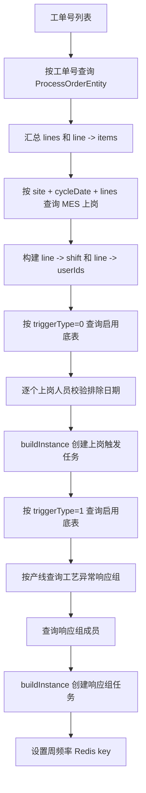

# 工艺点检模块设计文档

## 1. 文档说明

本文面向交接使用，以当前代码实现为准，说明工艺点检模块的职责边界、核心数据表、底表维护、工单触发、任务生成、移动端提交、主管审核、待办通知、自动关闭、统计口径和维护注意事项。

当前代码中“工艺点检”使用 `pce` 类型标识，对应移动端地址 `https://mas.minthgroup.com/m/#/audit/pce/`。它复用 taskflow 的任务组、审批节点、待办通知、转派、关闭和驱动任务统计能力，但任务生成逻辑主要围绕“工艺工单 + MES 上岗 + 工艺点检底表 + 审核人配置”展开。

## 2. 模块边界和代码入口

| 职责 | 主要代码 | 说明 |
| --- | --- | --- |
| 定时和外部触发入口 | `dap-biz/src/main/java/com/minthgroup/ees/dap/controller/taskflow/TimingTaskFlowController.java` | 接收工艺工单、按日期触发工艺点检、自动审核提醒、自动关闭、结束前提醒 |
| 底表接口 | `dap-biz/src/main/java/com/minthgroup/ees/dap/controller/taskflow/BaseProcessController.java` | 工艺点检底表分页、新增、修改、删除、导入、导出 |
| 任务接口 | `dap-biz/src/main/java/com/minthgroup/ees/dap/controller/taskflow/TaskProcessController.java` | 工艺点检任务分页、详情、提交、审核、删除、导出、历史字段补齐 |
| 底表服务 | `dap-biz/src/main/java/com/minthgroup/ees/dap/service/impl/taskflow/BaseProcessServiceImpl.java` | 底表版本、启停、周频率 Redis 去重、底表查询 |
| 工单服务 | `dap-biz/src/main/java/com/minthgroup/ees/dap/service/impl/taskflow/ProcessOrderServiceImpl.java` | 工艺工单落库和按工单号/日期查询 |
| 任务服务 | `dap-biz/src/main/java/com/minthgroup/ees/dap/service/impl/taskflow/TaskProcessServiceImpl.java` | 工艺点检任务生成、提交、审核、自动完成、导出 |
| 底表导入监听器 | `dap-biz/src/main/java/com/minthgroup/ees/dap/listener/ProcessImportListener.java` | Excel 导入校验、版本号计算、批量保存 |
| 驱动任务统计 | `dap-biz/src/main/java/com/minthgroup/ees/dap/handler/driveTask/PceDriveTaskStatistic.java` | 统计应完成、已完成、准时完成 |

## 3. 核心数据表

### 3.1 工艺点检底表 `c_taskflow_base_process`

实体：`BaseProcessEntity`

| 字段 | 说明 |
| --- | --- |
| `site` / `site_name` | 工厂代码和名称 |
| `process` / `process_desc` | 工序编号和描述 |
| `eam_num` / `eam_desc` | 资源编码，通常是 EAM 编码，及资源描述 |
| `item` / `item_desc` | 物料号和物料描述 |
| `line` | 产线编码。新增、修改和分页补偿时会按 `site + eamNum` 从组织资源回填 |
| `check_type` | 点检类型枚举 `CheckTypeEnum`，代码含 `D/W/M/Y` |
| `check_part` / `method` / `content` | 检测部位、方法、检查内容 |
| `frequency` | 频次枚举 `FrequencyV1Enum`，含 `B/D/W/M/Y` |
| `data_type` | 数据类型枚举 `DataTypeEnum`，含数值、OK/NG 文本、布尔值 |
| `target` / `max` / `min` | 目标值、上限、下限 |
| `check_user` | 底表中的点检人字段，仅随底表快照带入，任务生成实际按 MES 上岗或异常响应组生成 |
| `refer_img` | 参考图片 |
| `need_photograph` | 是否需要拍照，`Y/N` |
| `trigger_type` | 触发类型：`0` 表示上岗触发，`1` 表示 MES 工艺异常响应组触发 |
| `version` | 版本号 |
| `enable` | 是否启用：`1` 启用，`0` 停用 |

底表去重和版本规则：

1. 新增时按 `site + eamNum + item + checkPart + content + frequency + triggerType + enable=1` 判断是否已存在。
2. 修改不是原地覆盖。代码先把旧记录置为 `enable=0`，再插入一条 `version + 1` 的新启用记录。
3. 删除启用版本时，如果存在历史版本，会自动启用同一业务键下版本号最大的旧记录。
4. Excel 导入按同一业务键查最新版本，新版本为最新版本号 `+1`，并停用同一业务键下当前启用记录。

### 3.2 工艺工单表 `c_taskfilow_process_order`

实体：`ProcessOrderEntity`

| 字段 | 说明 |
| --- | --- |
| `site` | 工厂代码 |
| `cycle_date` | 周期日期 |
| `work_order_no` | 工单号 |
| `line` | 产线 |
| `item` | 物料号 |
| `eam_num` | EAM 编码 |

工艺点检任务不直接扫描所有底表生成，而是先有工艺工单。外部系统调用 `/timing/taskflow/process/order` 后，`ProcessOrderServiceImpl#processOrder` 会按 `site + item + workOrderNo + cycleDate` upsert 工单数据，再异步按工单号生成任务。

### 3.3 工艺点检任务表 `c_taskfilow_task_process`

实体：`TaskProcessEntity`

| 字段 | 说明 |
| --- | --- |
| `uuid` | 任务组业务主键，和 `TaskGroupEntity`、`ApprovedEntity` 关联 |
| `push_time` | 任务发起时间，代码使用 UTC |
| `site` / `site_name` | 工厂代码和名称 |
| `user_id` / `user_name` | 点检人 |
| `department` / `department_name` | 部门 |
| `classroom` / `classroom_name` | 课室 |
| `shift` / `shift_desc` | 班次编码和描述 |
| `shift_date` | 班次日期，也作为统计日期 |
| `line` | 产线 |
| `form_data` | 点检项快照，类型为 `List<ProcessCheckItem>` |
| `need_photograph` | 本任务是否需要拍照；只要任一底表项为 `Y`，任务即为 `Y` |
| `image_url` | 移动端提交的图片列表 |
| `instance_status` | 状态：`CREATED`、`SAVE`、`AUDIT`、`COMPLETED`、`CLOSED` 等 |
| `approved_user_id_list` | 候选审核人工号，逗号分隔 |
| `approved_user_id` | 实际审核人工号 |
| `approved` / `approved_desc` | 审核结果和审核意见，`approved=0` 表示 NG，`approved=1` 表示 OK |
| `review_type` | 审核类型，与底表 `trigger_type` 一致：`0` 上岗，`1` MES 工艺异常响应组 |
| `eam_nums` / `items` | 从 `form_data` 汇总出的 EAM 编码和物料号，历史数据可通过 `/taskflow/process/dealHistory` 补齐 |

`ProcessCheckItem` 是任务里的底表快照，主要字段包括：`process`、`processDesc`、`eamNum`、`eamDesc`、`item`、`itemDesc`、`checkPart`、`method`、`content`、`dataType`、`target`、`max`、`min`、`referImg`、`result`。

### 3.4 通用 taskflow 表

| 表/实体 | 作用 |
| --- | --- |
| `TaskGroupEntity` | 待办任务组。点检任务 `type=0`，审核任务 `type=1`，`checkType=pce` |
| `ApprovedEntity` | 审批节点。创建任务写入创建人和点检人节点；提交审核时写入审核人节点；审核后写入 OK/NG 结果节点 |
| `BaseUserEntity` | 点检/审核人员配置。工艺点检使用 `type=pce`，审核人使用 `role=3` |
| `BaseExcludeDateConfigEntity` | 人员排除日期配置，任务生成时按 `site + cycleDate + userId + pce` 判断是否执行 |

## 4. 枚举和配置

| 枚举/配置 | 值 | 说明 |
| --- | --- | --- |
| `TypeEnum.PCE` | `pce` | 工艺点检业务类型 |
| `TypeNoticeUrlEnum.PCE` | `https://mas.minthgroup.com/m/#/audit/pce/` | 移动端跳转地址 |
| `DriveTaskTypeEnum.T_PCE` | `pce` | 驱动任务统计类型 |
| `FrequencyV1Enum` | `B/D/W/M/Y` | 底表频率 |
| `DataTypeEnum` | `D_1/D_2/D_3` | 数值、OK/NG 文本、布尔值 |
| `CheckRoleEnum.R3` | `3` | 审核人 |
| i18n `Check_Name_pce` | 中文为“BBU管理员发起工艺点检” | 任务标题 |

## 5. 底表维护流程

### 5.1 新增

入口：`POST /base/process`

流程：

1. Controller 设置 `version=1`。
2. 按 `site + eamNum` 查询组织资源，存在时回填 `line`。
3. `BaseProcessServiceImpl#saveBase` 校验同一业务键下是否已有启用记录。
4. 设置 `enable=1` 并保存。

### 5.2 修改

入口：`PUT /base/process`

流程：

1. 按 `site + eamNum` 回填 `line`。
2. 查询旧记录，计算新版本号。
3. 旧记录置为 `enable=0`。
4. 清空新对象的 `id/create/update` 相关字段，插入新版本。

### 5.3 删除

入口：`DELETE /base/process`

流程：

1. 删除指定 id。
2. 如果删除的是启用记录，则按相同业务键查最大版本旧记录。
3. 存在旧记录时，将旧记录 `enable` 改回 `1`。

### 5.4 导入导出

导入入口：`POST /base/process/import?site=...`

导入校验：

1. 空行规则：`item`、`content`、`checkPart` 全为空时跳过。
2. 必填：物料号、检测部位、检查内容、频次、数据类型、触发类型。
3. `frequency` 必须能映射到 `FrequencyV1Enum` 代码。
4. `dataType` 必须能映射到 `DataTypeEnum`。
5. `triggerType` 只能为 `0` 或 `1`。
6. 有错误时返回 `ErrorMessage` 列表，不入库。
7. 无错误时批量保存，并停用同一业务键当前启用记录。

导出入口：`POST /base/process/export`

导出会把枚举转成描述，并输出启用/停用、版本号等信息。

## 6. 任务生成流程

工艺点检有两个触发入口：

| 入口 | 用途 |
| --- | --- |
| `POST /timing/taskflow/process/order` | 外部传入工艺工单后立即异步触发任务生成 |
| `GET /timing/taskflow/process?cycleDate=...` | 按日期补触发任务；当前代码只有 `bbuSites == "2871"` 时执行 |

### 6.1 工单触发入口

`/timing/taskflow/process/order` 的处理逻辑：

1. 记录入参日志。
2. 调用 `processOrderService.processOrder`，按 `site + item + workOrderNo + cycleDate` 更新或插入工单。
3. 从入参中提取工单号并去重。
4. 异步调用 `taskProcessService.createTaskByOrder(workOrderNoList)`。

### 6.2 按工单号生成任务

核心方法：`TaskProcessServiceImpl#createTaskByOrder`

主流程：

关键筛选条件：

1. 工单按 `workOrderNo` 查询，一张工单可对应多条 `line + item`。
2. MES 上岗按 `site + cycleDate + lines` 查询。
3. 上岗触发底表查询条件为 `site + line + item in items + enable=1 + triggerType=0`。
4. 异常响应组触发底表查询条件为 `site + line + item in items + enable=1 + triggerType=1`。
5. `FrequencyV1Enum.W` 会做 Redis 周频率控制。同一 `site + eamNum + item + checkPart + content` 一周内已触发过则不再返回。
6. 上岗触发会按 `BaseExcludeDateConfigService#isExecute(site, cycleDate, userId, pce)` 过滤不执行日期。
7. 异常响应组触发会按 `AbnormalResponseService#getUserGroup(site, line)` 查工艺异常响应组，再按 `MesUserGroupMemberService#getUserGroupMember(site, userGroup)` 查成员。

### 6.3 任务实例构建

核心方法：`TaskProcessServiceImpl#buildInstance`

创建前会按 `userId + shift + line + shiftDate` 判断是否已有任务，已有则不再创建。这个去重不区分工单号，也不区分 `triggerType`，因此同一人员、同一班次日期、同一班次、同一产线最多只有一条工艺点检任务。

创建内容：

1. 生成 `uuid`。
2. 创建 `TaskProcessEntity`，填充工厂、人员、部门、课室、班次、班次日期、产线、状态。
3. `reviewType` 取底表第一条的 `triggerType`。
4. 把底表列表复制为 `formData` 快照。
5. 只要有任一底表项 `needPhotograph=Y`，任务 `needPhotograph=Y`。
6. 从 `formData` 汇总去重后的 `eamNums` 和 `items`。
7. 写入 `ApprovedEntity` 创建人节点和点检人节点。
8. 创建 `TaskGroupEntity` 点检待办，`checkType=pce`，标题取 `Check_Name_pce`。
9. 计划完成时间为 `pushTime.plusDays(1)` 当天 `23:59:59.999`。
10. 发送移动端待办和 EES 个人待办。

## 7. 移动端查询和提交

### 7.1 任务详情

入口：`GET /taskflow/process/{uuid}`

返回 `TaskProcessVo`：

1. 先查 `TaskGroupEntity` 获取任务标题和发起人描述。
2. 再按 `uuid` 查 `TaskProcessEntity`。
3. 如果当前登录人属于 `approvedUserIdList`，返回 `approvedUserId`，用于前端识别当前审核人。
4. `formData` 直接来自任务快照。

### 7.2 任务提交

入口：`POST /taskflow/process/submit`

请求 DTO：`SaveTaskProcessDto`

| 字段 | 说明 |
| --- | --- |
| `id` | 必填，任务主键 |
| `uuid` | 入参有该字段，但提交时代码以数据库任务的 `uuid` 为准 |
| `formData` | 前端填写后的点检项 |
| `imageUrl` | 拍照图片列表 |

提交流程：

1. 校验 `id` 必填。
2. 查询任务，不存在则报“点检任务不存在”。
3. 用 DTO 构建更新对象，只更新提交内容、图片、状态相关字段。
4. 从原任务保留 `uuid`、`shiftDate`、`line`、`shift`，这些字段用于自动完成同班线任务。
5. 查询审核人：按 `site + classroom + type=pce + role=3` 获取基础人员表配置。
6. 再按任务 `reviewType` 和审核人 `reviewType` 匹配。
7. 如果审核人配置了 `line`，还必须与任务 `line` 一致；未配置 `line` 时只按课室匹配。
8. 调用 `TaskProcessServiceImpl#submit`。

提交后的状态：

1. 如果没有匹配到审核人，任务直接置为 `COMPLETED`，写入 `ApprovedEntity` 的 OK 节点。
2. 如果匹配到审核人，任务置为 `AUDIT`，给每个审核人创建审核待办和审批节点。
3. 点检人的 `TaskGroupEntity` 待办状态更新为已完成。
4. 更新任务前会把 `shiftDate`、`shift`、`line` 置空，避免提交内容覆盖这些关键生成字段。
5. 无审核人直接完成时，会自动完成同 `shiftDate + shift + line` 下其他 `CREATED/SAVE` 状态的工艺点检任务。

## 8. 审核流程

入口：`POST /taskflow/process/audit`

请求为 `List<AuditTaskDto>`。代码支持批量审核，但实际会按每个 `taskId` 分别处理。

审核流程：

1. 按 `taskId` 查询工艺点检任务，不存在则报错。
2. 按 `taskId + userId` 查询审核节点，不存在则报错。
3. `approved=0` 时审核结果为 NG，节点进度写 `4`。
4. `approved=1` 时审核结果为 OK，节点进度写 `3`。
5. 更新原审核节点进度。
6. 新增一条审核结果节点，`userName` 格式为 `OK-姓名(工号)` 或 `NG-姓名(工号)`。
7. 任务状态置为 `COMPLETED`，写入实际审核人、审核结果、审核意见。
8. 最后调用 `taskGroupService.updateAuditStatus(uuid, "1")`，把审核待办置为已处理。

当前实现没有像安全点检或设备点检那样在审核后调用 `ExceptionProcessService` 生成异常整改任务。NG 结果只记录在工艺点检任务和审批节点中。

## 9. 转派、关闭和自动任务

### 9.1 转派

通用入口在 `TaskGroupServiceImpl#reassign`，当 `checkType=pce` 时进入 `reassignPce`。

转派规则：

1. 只能转派 `TaskGroupEntity.status=0` 的待办。
2. 点检待办 `type=0` 时调用通用 `reassignCheck`。
3. 审核待办 `type=1` 时要求任务状态为 `AUDIT`，再调用 `reassignAudit`。
4. 转派后会用 `TypeNoticeUrlEnum.PCE` 发送钉钉通知。

注意：`reassignPce` 的审核转派分支里，更新审核人工号时使用的是 `TaskEquWkcEntity` 的 wrapper 和 `taskEquWckMapper`。这看起来是从设备点检复制遗留的实现，不会更新 `TaskProcessEntity.approvedUserId`。交接和排障时需要特别注意。

### 9.2 自动关闭

入口：`GET /timing/taskflow/auto/close`

通用自动关闭会调用 `autoAuditNoticeService.autoClosed(TypeEnum.PCE)`。真正关闭任务组时，`TaskGroupServiceImpl#closePce` 会把同 `uuid` 且状态为 `CREATED` 的工艺点检任务置为 `CLOSED`。

已提交、审核中或已完成的任务不会被 `closePce` 改成关闭。

### 9.3 自动审核和结束前提醒

| 入口 | 行为 |
| --- | --- |
| `GET /timing/taskflow/auto/audit` | 调用 `autoAuditNoticeService.autoAudit(TypeEnum.PCE)` |
| `GET /timing/taskflow/notifyBeforeShutdown` | 调用 `autoAuditNoticeService.notifyBeforeShutdown(site, TypeEnum.PCE)` |

这些能力是 taskflow 通用能力，工艺点检通过 `TypeEnum.PCE` 接入。

## 10. 导出和统计

### 10.1 任务导出

入口：`POST /taskflow/process/export`

导出两个 sheet：

1. “点检”：任务主数据。
2. “明细”：按 `formData` 拆出每个 `ProcessCheckItem`。

导出前会处理查询参数：

1. `shift` 入参 `D/M/N` 会转换为系统班次枚举值。
2. `pushTime` 和 `shiftDate` 日期范围会补齐到 `00:00:00` 和 `23:59:59`。
3. `instanceStatus` 会转换为中文描述。
4. `pushTime` 会按配置 `local.time-zone` 加小时偏移。

当前导出复用了 `TaskEquExcel` 和 `TaskEquDtExcel` DTO，命名上是设备点检，但实际数据来自工艺点检。

### 10.2 驱动任务统计

统计类：`PceDriveTaskStatistic`

统计口径来自 `TaskProcessMapper`：

| 指标 | SQL 条件 |
| --- | --- |
| 应完成数 | `shift_date like #{queryCycleDate}` |
| 已完成数 | `shift_date like #{queryCycleDate}` 且 `instance_status='COMPLETED'` |
| 准时完成数 | 已完成基础上，`time_out_status != '1' or time_out_status is null` |

统计按 `site/siteName/department/departmentName/userId/userName/classroom/classroomName` 聚合。统计后会判断部门是否属于当前工厂，不属于则归集到临时部门 `TEMP0001`。

## 11. 关键排查路径

### 11.1 工单触发后没有生成任务

按顺序检查：

1. `/timing/taskflow/process/order` 入参是否有 `site`、`cycleDate`、`workOrderNo`、`line`、`item`。
2. `c_taskfilow_process_order` 是否已写入对应工单。
3. `ProcessOrderServiceImpl#getOrderByWorkOrderNo` 是否能查到工单。该方法只按工单号查，不带工厂和日期。
4. `OndutyMesService#listBySiteAndLineAndDate` 是否能查到同 `site + cycleDate + line` 的上岗记录。
5. `c_taskflow_base_process` 是否有同 `site + line + item + enable=1` 的底表。
6. 底表 `trigger_type` 是否符合预期：上岗人员任务查 `0`，异常响应组任务查 `1`。
7. `FrequencyV1Enum.W` 的 Redis key `pce2:{site}:{eamNum}:{item}:{checkPart}:{content}` 是否已存在，存在则本周不会再次生成。
8. 上岗人员是否被 `BaseExcludeDateConfigService` 配置为当天不触发。
9. 是否已有同 `userId + shift + line + shiftDate` 任务，已有则 `buildInstance` 会跳过。

### 11.2 triggerType=1 没有生成任务

重点检查：

1. 底表 `trigger_type=1` 是否启用。
2. `AbnormalResponseService#getUserGroup(site, line)` 是否能查到该产线工艺异常响应组。
3. `MesUserGroupMemberService#getUserGroupMember(site, userGroup)` 是否有成员。
4. 成员工号是否能通过 `SyncEmpMapper#getEmpByEmpIdV1(userId, site)` 查到人员信息。
5. 同一成员同一班次日期、班次、产线是否已有任务。

### 11.3 提交后没有进入审核

重点检查：

1. 任务是否有 `classroom`。为空时不会查审核人。
2. `c_taskflow_base_user` 是否有 `site + classroom + type=pce + role=3` 的审核人。
3. 审核人的 `review_type` 是否与任务 `review_type` 一致。
4. 审核人如果配置了 `line`，是否与任务 `line` 一致。
5. 没有匹配审核人是当前允许场景，任务会直接 `COMPLETED`。

### 11.4 周频率任务重复或缺失

重点检查：

1. 周频率只对 `FrequencyV1Enum.W` 生效。
2. Redis key 不包含 `triggerType`、`line`、`method`，只包含 `site + eamNum + item + checkPart + content`。
3. 代码只在 `triggerType=1` 的 `createTaskByOrderAndGroup` 末尾调用 `baseProcessService.setFrequency(userProcesses)`。上岗触发 `triggerType=0` 查询时会检查周频率 key，但不会在生成后设置 key。
4. Redis TTL 到本周周日 `23:59:59`。

## 12. 维护注意事项

1. 工艺点检的任务生成依赖工艺工单、MES 上岗、底表、组织资源、异常响应组、人员信息和排除日期配置。排查时不要只看底表。
2. `buildInstance` 去重粒度是 `userId + shift + line + shiftDate`，不区分工单和触发类型。多工单同人同班线会合并为一条任务。
3. `formData` 是底表快照。底表修改不会影响已创建任务。
4. 提交时为了保护生成关键字段，`shiftDate/shift/line` 会置空后更新；自动完成逻辑依赖提交前缓存下来的旧值。
5. 无审核人时，提交会直接完成，并自动完成同班次日期、同班次、同产线的其他未提交任务。
6. 有审核人时，提交后状态为 `AUDIT`，审核后才 `COMPLETED`。
7. 当前工艺点检审核后不生成异常整改任务，NG 只体现在审核记录和任务字段。
8. `/timing/taskflow/process` 按日期补生成时，代码限定 `bbuSites == "2871"` 才执行。
9. `TaskProcessMapper` 统计 SQL 使用了 `time_out_status`，但 `TaskProcessEntity` 没有显式声明该字段。若数据库表缺该列，准时完成统计会报 SQL 错。
10. `reassignPce` 审核转派分支疑似错误使用设备点检 mapper，转派审核人字段可能不会写回工艺任务。
11. `TaskProcessService#listSearch` 目前从设备点检历史表查设备列表，工艺点检主流程未使用；不要把它当成工艺点检的权威数据来源。
12. 代码中部分注释和 Excel 表头存在编码显示问题，但业务字段、枚举和接口路径不受影响。

## 13. 常用接口清单

| 接口 | 方法 | 说明 |
| --- | --- | --- |
| `/base/process/page` | POST | 工艺点检底表分页 |
| `/base/process` | POST | 新增底表 |
| `/base/process` | PUT | 修改底表，新建版本 |
| `/base/process` | DELETE | 删除底表，必要时恢复旧版本 |
| `/base/process/import` | POST | 导入底表 |
| `/base/process/import/template` | GET | 下载导入模板 |
| `/base/process/export` | POST | 导出底表 |
| `/timing/taskflow/process/order` | POST | 接收工艺工单并异步生成工艺点检 |
| `/timing/taskflow/process` | GET | 按日期补触发工艺点检 |
| `/taskflow/process/page` | POST | 工艺点检任务分页 |
| `/taskflow/process/{uuid}` | GET | 移动端任务详情 |
| `/taskflow/process/submit` | POST | 提交工艺点检 |
| `/taskflow/process/audit` | POST | 审核工艺点检 |
| `/taskflow/process/export` | POST | 导出点检任务和明细 |
| `/taskflow/process/dealHistory` | GET | 补齐历史任务的 `eamNums/items` |
| `/timing/taskflow/auto/audit` | GET | 自动审核处理，包含 PCE |
| `/timing/taskflow/auto/close` | GET | 自动关闭超时未完成任务，包含 PCE |
| `/timing/taskflow/notifyBeforeShutdown` | GET | 结束前提醒，包含 PCE |
