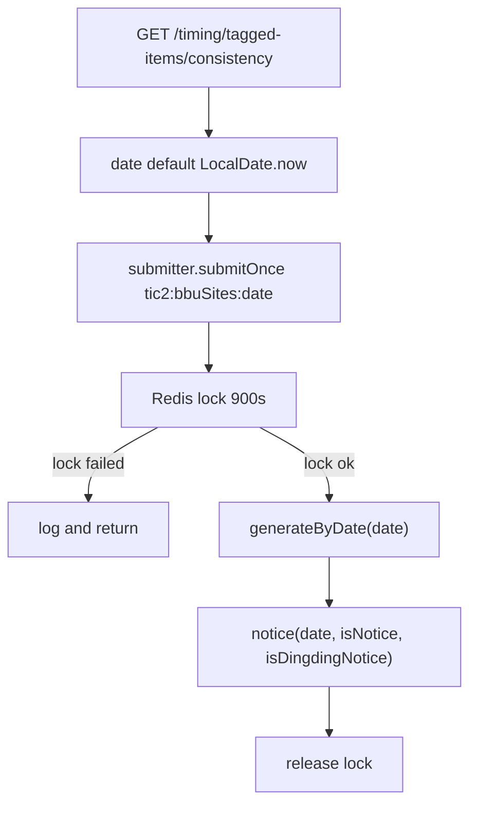
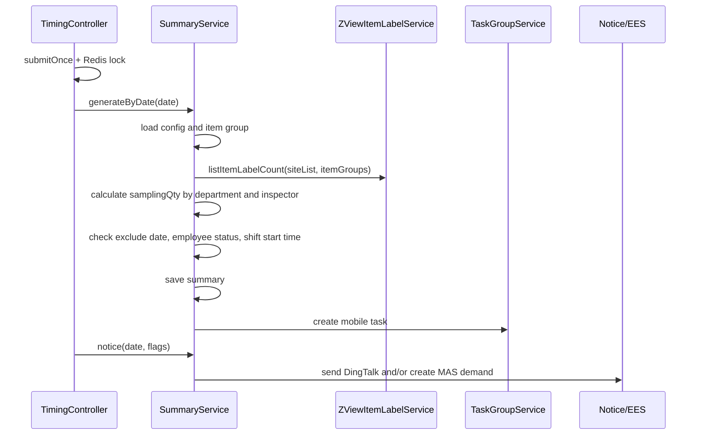
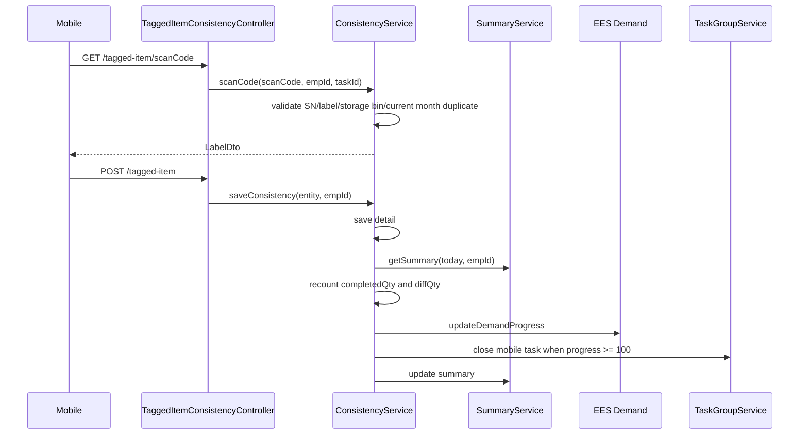
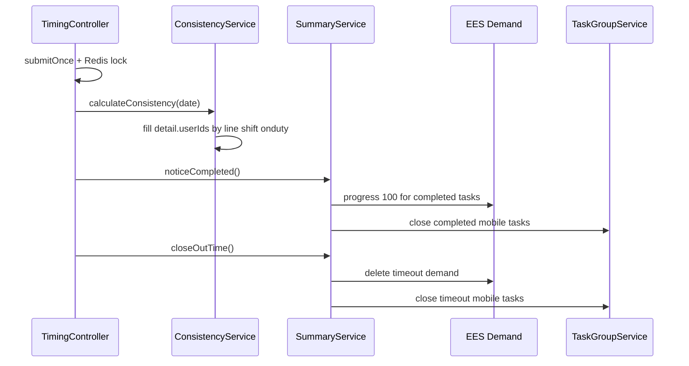

# 循环盘点模块设计文档

## 1. 文档目的

本文面向交接使用，以当前代码实现为准，说明循环盘点模块中“标签与实物一致性”任务的触发入口、任务生成规则、扫码确认、通知关闭、管理端查询、驱动任务统计和绩效扣分口径。

关键入口：

```java
@GetMapping("/tagged-items/consistency")
@NoToken
public R<Object> timingTaggedItemsConsistency(@RequestParam(required = false) LocalDate date,
                                              @RequestParam(required = false, defaultValue = "true") boolean isNotice,
                                              @RequestParam(required = false, defaultValue = "true") boolean isDingdingNotice)
```

该入口位于 `TimingController`，实际业务由 `TaggedItemsConsistencySummaryServiceImpl#generateByDate` 和 `TaggedItemsConsistencySummaryServiceImpl#notice` 承担。

## 2. 模块边界

当前代码中“循环盘点”存在两套相近命名：

| 类型 | 说明 |
| --- | --- |
| 标签与实物一致性循环盘点 | 本文重点，入口为 `/timing/tagged-items/consistency`，核心表为 `c_tagged_items_consistency_summary` 和 `c_tagged_items_consistency`，任务类型为 `tic`。 |
| 系统库存与实物库存一致性循环盘点 | `TimingController` 中另有“系统库存与实物库存一致性”相关入口和 `WarehouseInventory*` 代码，不属于本文主入口链路。 |

本文只覆盖用户指定的 `tagged-items/consistency` 链路。

## 3. 主要代码位置

| 职责 | 类或文件 | 说明 |
| --- | --- | --- |
| 定时/手工触发入口 | `dap-biz/src/main/java/com/minthgroup/ees/dap/controller/TimingController.java` | 生成循环盘点任务、回算标签归属人员、完成和超时关闭。 |
| 任务汇总服务 | `TaggedItemsConsistencySummaryServiceImpl` | 按配置生成应盘任务、创建移动端待办、发送钉钉和 MAS PC 待办、转发、完成关闭、超时关闭。 |
| 扫码明细服务 | `TaggedItemsConsistencyServiceImpl` | 扫码校验、保存盘点明细、更新任务进度、回填异常标签关联人员、计算扣分。 |
| 移动端扫码接口 | `TaggedItemConsistencyController` | `/tagged-item/scanCode`、`POST /tagged-item`、个人扫码记录和得分查询。 |
| 任务详情/转发接口 | `TaggedItemSummaryController` | `/tagged-item/dt`、`/tagged-item/{uuid}`、`/tagged-item/reassign`。 |
| 管理端接口 | `TaggedItemConsistencyMangeController` | 任务分页、扫码明细分页、导出、删除任务。注意路径拼写为 `/tagged-item/mange`。 |
| 抽查科室配置 | `TaggedItemConsistencyConfigController` | `/tagged-item/config`。 |
| 物料组配置 | `TaggedItemConsistencyItemGroupConfigController` | `/tagged-item/item-group/config`。 |
| 驱动任务统计 | `TicDriveTaskStatistic`、`TaggedItemsConsistencySummaryMapper` | 将 `tic` 任务纳入驱动任务完成率统计。 |
| 任务类型枚举 | `DriveTaskTypeEnum`、`TypeEnum`、`TypeNoticeUrlEnum` | `tic` 类型和通知跳转地址。 |

## 4. 核心数据模型

### 4.1 任务汇总表 `c_tagged_items_consistency_summary`

实体：`TaggedItemsConsistencySummaryEntity`

该表表示某个盘点日期、某个工厂、某个盘点人应完成的循环盘点任务。

| 字段 | 含义 |
| --- | --- |
| `id` | 任务主键，也是移动端任务 `uuid` 和通知跳转的 `taskId`。 |
| `site` | 工厂。 |
| `cycleDate` | 盘点日期。 |
| `inspecctor` | 原始盘点人工号。字段名代码中拼写为 `inspecctor`。 |
| `proxyUserId`、`proxyUserName` | 转发后的代理盘点人。 |
| `samplinQty` | 应抽数量。字段名代码中拼写为 `samplinQty`。 |
| `complrtedQty` | 已完成数量。字段名代码中拼写为 `complrtedQty`。 |
| `diffQty` | 差异数量汇总。 |
| `department` | 负责科室编码，可能是多个科室用分隔符拼接。 |
| `departmentDesc` | 科室名称，按站点语言渲染。 |
| `noticeId` | MAS PC 待办 ID。 |
| `noticeStatus` | 通知状态：代码注释表示 `0` 新建、`1` 进行中、`2` 结束、`3` 超时删除；实际生成时通常在创建 MAS 待办后置为 `1`。 |

### 4.2 扫码明细表 `c_tagged_items_consistency`

实体：`TaggedItemsConsistencyEntity`

该表表示每次扫码确认的标签盘点明细。

| 字段 | 含义 |
| --- | --- |
| `id` | 明细主键。 |
| `site` | 从标签主数据带出。 |
| `labelId` | 标签号，保存时必填。 |
| `item`、`itemDescription` | 物料号和物料描述，从标签主数据带出。 |
| `measuredQty` | 系统结余数量，从标签主数据带出。 |
| `actualQty` | 实际盘点数量，提交时必填。 |
| `diffQty` | 差异数量。前端未传时按 `measuredQty - actualQty` 计算。 |
| `unit` | 单位。 |
| `storageBin`、`storageBinDescription` | 库位和库位描述。 |
| `department` | 标签对应责任人的科室。 |
| `productionLine` | 从库位配置解析出的归属产线。 |
| `userIds` | `calculateConsistency` 回填的当班上岗人员，用于差异归责和绩效扣分查询。 |

### 4.3 抽查科室配置表 `c_tagged_items_consistency_config`

实体：`TaggedItemsConsistencyConfigEntity`

| 字段 | 含义 |
| --- | --- |
| `site` | 工厂。 |
| `department1`、`department1Name` | 上级部门编码和名称，由 `updateDepartment` 按科室补齐。 |
| `department`、`departmentDesc` | 科室编码和描述。 |
| `inspecctor` | 盘点人，多个工号用逗号分隔。 |
| `percentage` | 抽查比例，空值按 100% 处理。 |

新增配置时只按 `department like entity.department` 判断重复，没有按 `site` 限定，交接时需要注意。

### 4.4 物料组配置表 `c_tagged_items_consistency_itemgroup_config`

实体：`TaggedItemsConsistencyItemGroupConfigEntity`

生成任务时通过该配置取物料组列表，再传给 `ZViewItemLabelService#listItemLabelCount(siteList, itemGroups)` 统计标签数量。新增配置按 `site + itemGroup` 去重。

## 5. 任务生成主流程

入口：`GET /timing/tagged-items/consistency`

参数：

| 参数 | 默认值 | 作用 |
| --- | --- | --- |
| `date` | 当前日期 `LocalDate.now()` | 生成指定盘点日期任务。 |
| `isNotice` | `true` | 是否创建 MAS PC 待办。 |
| `isDingdingNotice` | `true` | 是否发送钉钉通知。 |

执行特征：

1. Controller 构造 key：`tic2:{bbuSites}:{date}`。
2. 使用 `submitter.submitOnce(key, runnable)` 做一次性异步提交。
3. runnable 内使用 Redis 锁，锁 key 同上，锁值为 UUID，过期 900 秒。
4. 获取锁失败时直接记录日志并结束。
5. 获取锁成功后先执行 `generateByDate(date)`，再执行 `notice(date, isNotice, isDingdingNotice)`。
6. 通知逻辑被单独 try-catch 包裹，通知失败不会回滚已生成的任务。
7. finally 中释放 Redis 锁。



## 6. 应抽数量计算规则

实现位置：`TaggedItemsConsistencySummaryServiceImpl#generateByDate`

### 6.1 加载配置和库存标签数量

1. 读取全部抽查科室配置：`configService.listAll()`。
2. 如果没有配置，记录 `No tagged items consistency config found` 并结束。
3. 从配置中收集工厂 `siteList`、盘点人工号与科室映射、科室编码集合。
4. 读取全部物料组配置：`itemGroupConfigService.listAll()`。
5. 调用 `zViewItemLabelService.listItemLabelCount(siteList, itemGroups)` 获取按工厂分组的标签数量。
6. 如果没有标签数量数据，记录 `No inventory count label data found` 并结束。

### 6.2 计算科室标签总量

对每个工厂的标签数量列表：

1. 从标签责任人 `responsibleUser` 取员工信息：`hcmEmpMapper.listEmpByUserId(userIds)`。
2. 只保留员工 `deptid4` 非空且在配置科室集合内的数据。
3. 同一员工多条数据时，优先保留 `jobIndicator = P` 的记录。
4. 得到 `userId -> deptid4` 映射。
5. 按责任人所属科室汇总标签数量，得到 `department -> total`。

### 6.3 计算盘点人应抽数量

对每条科室配置：

1. 取配置的科室总标签数 `total`。
2. 取配置的盘点人列表 `inspecctor.split(",")`，人数为 `empCount`。
3. 默认出勤天数为 22 天。
4. 当 `local.time-zone == 8` 时，会调用盖雅接口 `monthAttendanceSumDataLeave` 获取当月出勤汇总；按 `workdate78 > 0` 的天数统计出勤天数。
5. 如果出勤数据为空或计算结果小于 1，则仍按 22 天。
6. 抽查比例 `percentage` 为空时按 100%。
7. 单个配置的应抽数量公式：

```text
samplingQty = ceil(total / days * percentage / 100 / empCount)
```

8. 如果同一个盘点人配置了多个科室，会把多个科室计算出的 `samplingQty` 累加到同一个盘点人任务上。

### 6.4 任务生成条件

实现位置：`createSummaryEntities` 和 `hasExecuted`

生成任务前会依次判断：

1. 同一 `site + cycleDate + inspecctor` 已有任务时不重复生成。
2. 排除日配置不允许执行时跳过：`excludeDateConfigService.isExecute(site, date, userId, TypeEnum.TIC.getCode())`。
3. `hcmService.getPrimaryPositionUser(userId)` 查不到员工时跳过。
4. 员工状态为 `"4"`，即离职时跳过。
5. `AttendanceUtils.getShiftDataListV1(site, userId, date)` 查不到排班时跳过。
6. 取第一条排班，将 `cycleDate + startTime` 组成班次开始时间；只有班次开始时间早于当前本地时间 `UTC + local.time-zone` 才生成任务。

满足条件后：

1. 保存 `TaggedItemsConsistencySummaryEntity`。
2. 创建移动端 `TaskGroupEntity`：
   - `userId` 为盘点人。
   - `initiator` 为 `SiteLangUtil.render(site, "Check_Creator")`。
   - `uuid` 为汇总任务 `id`。
   - `checkName` 为 `SiteLangUtil.render(site, "Check_Name_tic", classDesc)`。
   - `checkType` 为 `TypeEnum.TIC.getCode()`。
   - `type = "0"`。
   - `status = "0"`。
   - `pushTime = now(UTC)`。
   - `scheduledTime = now(UTC) + 24h`。

## 7. 通知流程

实现位置：`TaggedItemsConsistencySummaryServiceImpl#notice`

查询条件：

```text
cycle_date = cycleDate
and notice_id is null
```

也就是说，只有尚未创建 MAS PC 待办的任务才会进入通知流程。

### 7.1 钉钉通知

当 `isDingdingNotice = true`：

1. 创建 `DingdingMsg`。
2. `site` 使用任务工厂。
3. `title` 使用 `SiteLangUtil.render(site, "Check_Name_tic_Today")`。
4. `msgUrl` 使用 `TypeNoticeUrlEnum.TIC.getMsgUrl() + "?site={site}&taskId={id}"`。
5. 调用 `sendNoticeService.sendTicByDingdingV1(dingdingMsg, inspecctor)`。

单条钉钉通知异常只记录日志，不影响后续任务。

### 7.2 MAS PC 待办

当 `isNotice = true`：

1. 构造 `DemandSaveDTO`。
2. `source = "S11"`。
3. `remark` 使用 `SiteLangUtil.render(site, "Cycle_Demand_Msg")`，填充日期、科室描述和应抽数量。
4. `executorCode = inspecctor`。
5. `executorName` 通过 `hcmPaEmpBbuSyncService.getUerDeptCodes(userIds)` 查询。
6. `planFinishTime` 为 Asia/Shanghai 当天 `23:59:59.999999`。
7. 调用 `eesSystemService.createDemand(entity)`。
8. 将返回的 `data` 写入 `noticeId`，并将 `noticeStatus` 置为 `"1"`。

注意：即使 `createDemand` 返回非成功 code，只要返回对象非空，当前代码仍会把 `data` 写入 `noticeId`。

## 8. 扫码确认流程

### 8.1 扫码接口

入口：`GET /tagged-item/scanCode`

参数：

| 参数 | 说明 |
| --- | --- |
| `scanCode` | 扫描码，不能为空。 |
| `taskId` | 可选，指定任务 ID。 |

当前用户工号取 `SecurityUtils.getUser().getName()`。

实现位置：`TaggedItemsConsistencyServiceImpl#scanCode`

校验逻辑：

1. 先按 SN 查询 `itemLabelDetailService.getLabelIdBySn(scanCode)`。
2. 如果 SN 命中多条，抛出异常。
3. 如果 SN 命中一条，将 `scanCode` 替换为对应 `lineId`；如果明细状态为 `"N"`，抛出“已失效”异常。
4. 按标签号或容器号查询 `itemLabelService.listByLabelIdOrContainerNo(scanCode)`。
5. 查不到、查到多条都抛出异常。
6. 检查该标签当月是否已盘点：`isConfirmedCurrentMonth(labelId)`，已盘点则抛出异常。
7. 填充 `LabelDto`，包括单位和库位展示字段。
8. 调用 `storageBinService.getProductionLine(site, storageBin)` 校验库位配置，查不到抛出异常。
9. 如果传了 `taskId`，按任务 ID 查询汇总任务；否则按当前日期和当前用户查任务。
10. 查询到任务时，把 `samplinQty` 和 `complrtedQty` 回填到返回 DTO。

### 8.2 保存确认接口

入口：`POST /tagged-item`

请求体：`TaggedItemsConsistencyEntity`，其中 `labelId` 和 `actualQty` 必填。

实现位置：`TaggedItemsConsistencyServiceImpl#saveConsistency`

保存逻辑：

1. 按 `labelId` 查询标签主数据 `itemLabelService.listByLabelId`，查不到抛出异常。
2. 从标签主数据带出 `site`、物料、描述、系统数量、单位、库位等字段。
3. 如果请求未传 `diffQty`，则按 `measuredQty - actualQty` 计算。
4. 再次检查该标签当月是否已盘点，防止重复提交。
5. 按标签工厂和库位查询产线配置 `storageBinService.getProductionLine`，查不到抛出异常。
6. 将产线写入 `productionLine`。
7. 根据库位配置的 `responsibleUserBo` 调 `eesSystemService.getSimpleDetailsBatch` 获取责任人科室，写入 `department`。
8. 保存扫码明细。
9. 查询当前日期、当前提交人对应的汇总任务：`summaryService.getSummary(LocalDate.now(), inspecctor)`。
10. 如果没有汇总任务，明细仍保存成功，直接返回。
11. 统计原盘点人和代理盘点人当天提交的明细数量，更新 `complrtedQty`。
12. 统计原盘点人和代理盘点人当天提交明细的 `diff_qty` 总和，更新 `diffQty`。
13. 如果 `noticeStatus != "2"`，按 `complrtedQty / samplinQty` 更新 MAS PC 待办进度。
14. 进度达到 100% 时，将汇总任务 `noticeStatus` 置为 `"2"`，并调用 `taskGroupService.updateStatus(id, "1")` 关闭移动端待办。
15. 更新汇总任务。

进度计算代码中存在一个细节：

```java
double processValue = complrtedQty1 / summaryEntity.getSamplinQty();
processValue = processValue > BigInteger.ONE.bitCount() ? 100 : processValue * 100;
```

`BigInteger.ONE.bitCount()` 等于 1，因此比例大于 1 时进度置 100，否则乘 100。

## 9. 回算和任务关闭流程

入口：`GET /timing/tagged-items/calculate-consistency`

参数：

| 参数 | 默认值 | 作用 |
| --- | --- | --- |
| `date` | 当前日期 | 回算指定日期扫码明细的当班人员归属。 |

执行特征：

1. Controller 构造 key：`ticc:{bbuSites}:{date}`。
2. 使用 `submitter.submitOnce(key, runnable)` 和 Redis 锁，锁值为 `bbuSites`，过期 900 秒。
3. 执行 `taggedItemsConsistencyService.calculateConsistency(date)`。
4. 执行 `taggedItemsConsistencySummaryService.noticeCompleted()`。
5. 执行 `taggedItemsConsistencySummaryService.closeOutTime()`。
6. finally 中释放锁并删除 key。

### 9.1 回填扫码明细归属人员

实现位置：`TaggedItemsConsistencyServiceImpl#calculateConsistency`

处理范围：

```text
create_time 在 date 当天
and production_line is not null
```

对每条扫码明细：

1. 取 `productionLine` 和 `site`，为空跳过。
2. 调 `mesSapPlanShiftService.getShiftByLine(productionLine, createTime)` 查产线日历。
3. 取第一条日历的 `shift`，为空跳过。
4. 用 `productionLine + shift` 做本地缓存，避免同产线同班次重复查询。
5. 缓存未命中时，调用 `ondutyDetailService.getOnDutyByTime(site, productionLine, shift, date)` 查上岗明细。
6. 只保留同班次人员，拼接 `userId` 为逗号分隔字符串。
7. 更新扫码明细 `userIds`。

该字段后续用于 `listNoConsistency` 和绩效扣分查询，差异记录通过 `diffQty != 0` 判断。

### 9.2 已完成任务关闭

实现位置：`TaggedItemsConsistencySummaryServiceImpl#noticeCompleted`

查询最近 30 天内未结束/未超时且数量字段满足条件的汇总任务：

```text
notice_status not in ('2', '3')
and complrted_qty >= 0
and samplin_qty >= 0
and create_time >= now(UTC) - 30 days
```

对每条任务：

1. 如果 `samplinQty > complrtedQty`，跳过。
2. 否则调用 `eesSystemService.updateDemandProgress`，进度置 100，备注为任务完成。
3. 将 `noticeStatus` 置为 `"2"`。
4. 调 `taskGroupService.updateStatus(id, "1")` 关闭移动端待办。

### 9.3 超时任务关闭

实现位置：`TaggedItemsConsistencySummaryServiceImpl#closeOutTime`

查询未结束/未超时且创建时间超过 24 小时的任务：

```text
notice_status not in ('2', '3')
and create_time < now(UTC) - 24 hours
```

对每条任务：

1. 调 `sendNoticeService.cancelDemandProgressByUuid(uuid)` 关闭 MAS PC 端个人待办。
2. 调 `eesSystemService.deleteDemandNoToken(noticeId)` 删除 EES 待办。
3. 删除成功后将 `noticeStatus` 置为 `"3"`。
4. 调 `taskGroupService.updateStatus(id, "1")` 关闭移动端待办。

## 10. 任务转发和删除

### 10.1 转发

入口：`GET /tagged-item/reassign`

参数：`id`、`targetUserId`、`targetUserName`

流程：

1. 按 ID 查询汇总任务，不存在则抛出“任务已被撤销”。
2. 写入 `proxyUserId`、`proxyUserName`。
3. 更新 `TaskGroupEntity`：按 `uuid = id` 且 `type = "0"` 将 `userId` 改为目标用户。
4. 向目标用户发送钉钉通知，标题使用 `Check_Name_tic_Proxy`，跳转地址仍为 `?site={site}&taskId={id}`。

转发后保存扫码明细时，进度统计会同时纳入原盘点人和代理盘点人当天提交的明细。

### 10.2 管理端删除任务

入口：`DELETE /tagged-item/mange`

流程：

1. `summaryService.delTaskByIds(ids)` 删除汇总任务。
2. 按任务 ID 删除移动端待办：`taskGroupService.removeByUuid(uuid)`。
3. 调 `sendNoticeService.cancelDemandProgressByUuid(uuid)` 关闭 MAS 待办。

该删除不会删除已经保存的扫码明细。

## 11. 查询和导出接口

### 11.1 移动端/个人侧

| 方法 | 路径 | 说明 |
| --- | --- | --- |
| `GET` | `/tagged-item/dt?id={id}` | 按任务 ID 查询汇总任务。 |
| `GET` | `/tagged-item/{uuid}` | 按 uuid 查询汇总任务。 |
| `GET` | `/tagged-item/scanCode` | 扫码预校验并返回标签信息。 |
| `POST` | `/tagged-item` | 保存标签与实物一致性确认结果。 |
| `GET` | `/tagged-item/page` | 查询当前用户自己的扫码明细。 |
| `GET` | `/tagged-item/getTaggedItemsConsistencyScore` | 查询当前用户视角下的标签一致性扣分结果。 |

### 11.2 管理端

| 方法 | 路径 | 说明 |
| --- | --- | --- |
| `GET` | `/tagged-item/mange/task/page` | 任务分页，支持工厂、盘点人、科室、日期、完成状态过滤。 |
| `DELETE` | `/tagged-item/mange` | 删除任务并关闭待办。 |
| `GET` | `/tagged-item/mange/page` | 扫码明细分页。 |
| `GET` | `/tagged-item/mange/task/export` | 导出循环盘点任务。 |
| `GET` | `/tagged-item/mange/export` | 导出已扫条码明细。 |
| `GET` | `/tagged-item/mange/task/updateClassroom` | 按日期刷新任务科室名称。 |

管理端任务状态不是直接读取 `noticeStatus`，而是按数量判断：

| 查询状态 | 判断条件 |
| --- | --- |
| `1` 未完成 | `complrted_qty < samplin_qty or complrted_qty is null` |
| `2` 已完成 | `complrted_qty >= samplin_qty` |

## 12. 配置维护接口

### 12.1 抽查科室配置 `/tagged-item/config`

| 方法 | 路径 | 说明 |
| --- | --- | --- |
| `GET` | `/page` | 按 `site` 分页查询配置，并补充盘点人姓名。 |
| `GET` | `/details` | 按实体条件查询详情。 |
| `POST` | `/` | 新增配置。 |
| `PUT` | `/` | 修改配置。 |
| `DELETE` | `/` | 批量删除配置。 |

### 12.2 物料组配置 `/tagged-item/item-group/config`

| 方法 | 路径 | 说明 |
| --- | --- | --- |
| `GET` | `/page` | 按 `site`、物料组、物料组描述分页查询。 |
| `POST` | `/` | 新增配置。 |
| `PUT` | `/` | 修改配置。 |
| `DELETE` | `/` | 批量删除配置。 |

注意：当前物料组分页中，`itemGroupDesc` 条件实际也作用在 `itemGroup` 字段上，交接排查时需要注意。

## 13. 驱动任务统计

循环盘点任务类型为 `tic`，在 `DriveTaskTypeEnum` 中对应 `T_TIC("tic", "循环盘点任务")`。

统计器：`TicDriveTaskStatistic`

数据来源：`TaggedItemsConsistencySummaryMapper`

统计口径：

| 指标 | SQL 条件 |
| --- | --- |
| 总任务数 | `cycle_date like queryCycleDate and del_flag = '0'`，按 `site, department, inspecctor` 分组。 |
| 完成任务数 | 在总任务条件基础上增加 `complrted_qty >= samplin_qty`。 |
| 及时完成任务数 | 当前 SQL 与完成任务数相同，也是 `complrted_qty >= samplin_qty`。 |

统计器会把 `department` 字段当作课堂/科室字段处理。如果字段中有多个科室，会先按分隔符拆分并取第一个科室，再通过 `SyncEmpMapper` 补齐上级部门信息。

## 14. 绩效扣分口径

实现位置：`TaggedItemsConsistencyServiceImpl#getTaggedItemsConsistencyScore`

核心规则：

1. 只统计 `diffQty != 0` 的扫码明细。
2. 默认扣分标准为 `10.0`。
3. 如果存在指标配置 `indicatorCode = "D012"` 且匹配站点，则使用 `IndicatorSettingEntity#deductPoints`。
4. 返回 `times = 差异明细条数`。
5. 返回 `score = times * deductPoints`。
6. 返回 `details` 为差异明细转换后的 Map 列表。

时间范围：

| 用户类型 | 时间范围 |
| --- | --- |
| 线长 | 通过 `shiftPlanService.getShiftMapByUser` 获取当前用户指定日期班次开始和结束时间。 |
| 科长/部门负责人 | 通过产线日历 `mesSapPlanShiftService.getShiftByLine` 获取日期或月份范围内的最早班次开始和最晚班次结束时间。 |

组织范围：

| 用户类型 | 过滤范围 |
| --- | --- |
| 线长 | 按 `productionLine in lineList`。 |
| 科长/部门负责人 | 按 `department in deptCodeList`。 |

另有重载方法支持外部传入 `dataMap` 和 `site`，用于按 `UserTypeConstants.LINE_LEADER`、`DEPT_LEADER`、`EMPLOYEE` 判断范围；员工类型直接返回 `times = -1`。

## 15. 外部依赖

| 依赖 | 用途 |
| --- | --- |
| Redis | 生成任务和回算任务的分布式锁。 |
| `SafeTaskSubmitter` 或同类 submitter | Controller 异步提交且同 key 去重。 |
| `ZViewItemLabelService` | 查询标签数量、标签主数据。 |
| `ItemLabelDetailService` | 支持 SN 反查标签号。 |
| `StorageBinService` | 按工厂和库位解析产线、责任人。 |
| `HcmService`、`HcmEmpMapper`、`HcmPaEmpBbuSyncService` | 员工状态、科室、姓名、岗位信息。 |
| `AttendanceUtils`、`GaiYaService` | 排班判断和月出勤天数计算。 |
| `BaseExcludeDateConfigService` | 判断某员工某日期是否跳过 `tic` 任务。 |
| `EesSystemService` | 创建、更新、删除 MAS PC 待办和查询员工详情。 |
| `SendNoticeService` | 发送钉钉通知、关闭 MAS 待办。 |
| `TaskGroupService` | 创建、转发、关闭移动端待办。 |
| `MesSapPlanShiftService`、`OndutyDetailService` | 回算扫码差异归属到当班上岗人员。 |
| `OrganizationService`、`ShiftPlanService`、`IndicatorSettingService` | 绩效扣分查询。 |

## 16. 关键时序

### 16.1 每日任务生成



### 16.2 扫码提交



### 16.3 回算和关闭



## 17. 运维和排查要点

1. 任务生成接口是异步返回 `R.ok()`，成功响应只表示已提交，不代表任务已生成完成。
2. Redis 锁过期时间为 900 秒，长时间执行时需要关注锁提前过期后的重复触发风险。
3. 同一天同工厂同盘点人只会生成一条汇总任务；配置变更后重复触发不会更新已存在任务的应抽数量。
4. 任务生成依赖排班开始时间，班次未开始时不会生成任务。
5. `notice` 只处理 `noticeId is null` 的任务；如果创建 MAS 待办失败但写入了异常 `noticeId`，再次触发不会重试这条任务。
6. 保存扫码明细按当前日期和当前提交人查汇总任务，没有使用请求中的 `taskId` 绑定汇总任务；转发场景通过 `proxyUserId` 统计进度。
7. 标签重复盘点校验按当前自然月 `create_time` 判断，不按任务日期判断。
8. 回算 `userIds` 依赖产线日历和上岗明细；查不到班次或上岗人员时，该明细不会参与后续按人员归责的差异查询。
9. 超时关闭按 `create_time < now(UTC) - 24h` 判断，和业务本地时区不完全一致。
10. 管理端路径拼写为 `/tagged-item/mange`，不是 `/manage`。
11. 代码中字段名存在历史拼写：`inspecctor`、`samplinQty`、`complrtedQty`，数据库和 DTO 使用时需保持一致。
12. 当前源码中文注释和部分字符串在部分终端可能显示乱码，排查时优先以方法名、字段名、枚举 code、SQL 条件和接口路径为准。

## 18. 常见交接问题

### 18.1 为什么触发接口返回成功但没有任务？

可能原因：

1. 没有抽查科室配置。
2. 没有物料组配置或标签数量查询为空。
3. 配置科室下没有可匹配的标签责任人。
4. 员工离职、查不到员工主岗、无排班。
5. 班次开始时间晚于当前本地时间。
6. 排除日期配置阻止执行。
7. 同一 `site + cycleDate + inspecctor` 已经存在任务。
8. 上一次同 key 异步任务仍在运行或 Redis 锁未释放。

### 18.2 为什么扫码后任务进度没涨？

可能原因：

1. 当前提交人当天没有汇总任务。
2. 汇总任务在原盘点人名下，但当前提交人不是原盘点人或代理人。
3. `samplinQty` 为空或为 0 导致进度逻辑异常。
4. MAS 待办更新失败，但本地明细仍已保存。
5. 明细已保存，但 `summaryService.updateById` 更新汇总失败。

### 18.3 为什么绩效扣分查不到差异？

可能原因：

1. 明细 `diffQty = 0`，不会计入扣分。
2. 回算任务未执行，`userIds` 未回填。
3. 产线日历或上岗明细缺失，导致 `userIds` 无法回填。
4. 查询用户不是线长或科长/部门负责人，或组织配置中找不到对应产线/科室。
5. 查询时间范围来自班次开始/结束时间，不是简单的自然日。

## 19. 建议后续优化点

以下不是当前实现，但交接后维护时建议优先关注：

1. 将生成入口从 GET 副作用接口逐步改造为 POST，并返回可追踪任务 ID。
2. 将 `notice` 的 MAS 待办创建成功判断收紧，避免失败响应写入 `noticeId` 后无法重试。
3. 保存扫码明细时显式绑定 `taskId`，避免仅靠当前日期和当前用户推断汇总任务。
4. 将 `inspecctor`、`samplinQty`、`complrtedQty` 等历史拼写隔离到数据库层，DTO 层提供正确命名。
5. 把回算 `userIds` 的失败原因落库或结构化记录，便于绩效差异归责排查。
6. 统一超时判断时区，避免 UTC 与本地业务日期混用。
7. 给配置去重补充 `site` 条件，并修复物料组配置分页中 `itemGroupDesc` 查询字段。
