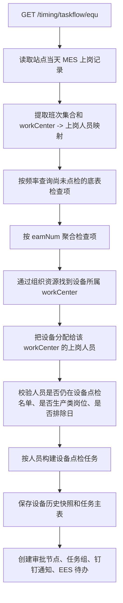
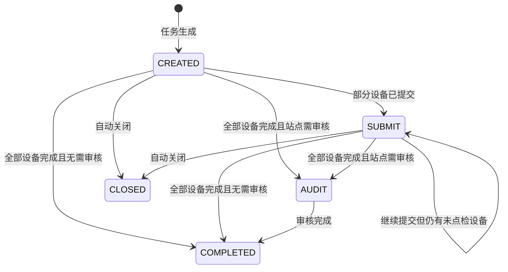

# 设备点检模块设计文档

## 1. 文档目的

本文面向交接使用，以当前代码实现为准，说明设备点检模块的职责边界、核心数据表、底表维护、任务生成、移动端提交、主管审核、异常处理、统计口径和维护注意事项。

当前代码中“设备点检”主要使用 `equ` 类型标识，对应移动端地址 `https://mas.minthgroup.com/m/#/audit/equ/`。设备点检和 DDS、5S、SOP 共用 taskflow 的任务组、审批节点、通知待办、自动关闭等通用能力，但任务生成逻辑以设备资源、MES 上岗、底表频率和历史点检明细为核心。

## 2. 模块边界

### 2.1 主要代码位置

| 类型 | 路径 | 说明 |
| --- | --- | --- |
| 定时入口 | `dap-biz/src/main/java/com/minthgroup/ees/dap/controller/taskflow/TimingTaskFlowController.java` | 触发设备点检生成、按用户补生成、历史数据修正、自动关闭、结束前提醒 |
| 任务接口 | `dap-biz/src/main/java/com/minthgroup/ees/dap/controller/taskflow/TaskEquController.java` | 设备列表、任务分页、任务详情、提交、审核、批量审核、删除、导出 |
| 底表接口 | `dap-biz/src/main/java/com/minthgroup/ees/dap/controller/taskflow/BaseEquController.java` | 设备点检底表增删改查、启停、导入、导出 |
| 任务服务 | `dap-biz/src/main/java/com/minthgroup/ees/dap/service/impl/taskflow/TaskEquServiceImpl.java` | 设备点检生成、提交、审核、异常处理、导出、历史数据修正 |
| 底表服务 | `dap-biz/src/main/java/com/minthgroup/ees/dap/service/impl/taskflow/BaseEquServiceImpl.java` | 底表版本、启停、频率去重查询 |
| 历史设备服务 | `BaseEquHistoryServiceImpl.java` | 保存任务设备快照，维护设备是否已点检 |
| 历史明细服务 | `BaseEquHistoryDetailsServiceImpl.java` | 保存已完成检查项明细，用于后续频率去重 |
| 底表导入监听器 | `EquV1ImportListener.java` | Excel 导入设备点检底表 |
| 任务实体 | `TaskEquEntity.java` | 表 `c_taskfilow_task_equ` 映射 |
| 底表实体 | `BaseEquEntity.java` | 表 `c_taskflow_base_equ` 映射 |
| 历史设备实体 | `BaseEquHistoryEntity.java` | 表 `c_taskflow_base_equ_history` 映射 |
| 历史明细实体 | `BaseEquHistoryDetailsEntity.java` | 表 `c_taskflow_base_equ_history_details` 映射 |
| Mapper | `BaseEquMapper.java` / `TaskEquMapper.java` | 底表频率去重查询、任务统计查询 |

### 2.2 外部依赖

| 依赖 | 用途 |
| --- | --- |
| `OndutyMesService` | 按站点、日期或用户读取 MES 上岗记录，决定任务分配到哪些上岗人员 |
| `OrganizationService` | 通过 `site + eamNum` 找设备资源所属工作中心、产线、课室、资源描述 |
| `BaseUserService` | 校验设备点检人员配置，读取审核人配置 |
| `BaseExcludeDateConfigService` | 判断人员在指定日期是否需要生成设备点检 |
| `TaskGroupService` | 创建任务组、待办、审核待办，更新任务完成/审核状态 |
| `ApprovedService` | 创建和更新流程节点 |
| `SendNoticeService` | 发送钉钉通知、EES 个人待办、刷新/取消需求进度 |
| `ExceptionProcessService` | 审核后把 NG 项转为 `equ_exc` 异常处理任务 |
| `LendBorrowInfoService` / `AreaSiteService` / `SyncEmpMapper` | 修正外部借调人员的部门、课室信息 |
| `TaskflowProperty` | 读取 `taskflow.equ.audit-site`，决定哪些站点提交后需要审核 |

## 3. 核心数据模型

### 3.1 设备点检底表 `c_taskflow_base_equ`

实体：`BaseEquEntity`

这是设备检查项配置表。每条记录代表某台设备的一个检查项，任务生成时会按设备聚合成移动端表单快照。

| 字段 | 含义 |
| --- | --- |
| `site` / `site_name` | 工厂代码 / 工厂名称 |
| `eam_num` / `eam_desc` | EAM 设备编码 / 设备描述 |
| `classroom` / `classroom_name` | 课室编码 / 课室名称，保存时会尝试从组织资源自动回填 |
| `line` | 产线，保存时会尝试从组织资源自动回填 |
| `check_type` | 点检类型枚举 `CheckTypeEnum`，代码为 `D/W/M/Y` |
| `check_part` | 检测部位 |
| `method` | 方法 |
| `content` | 检查内容 |
| `frequency` | 频率枚举 `FrequencyV1Enum`，当前代码使用 `B/D/W/M/Y` |
| `data_type` | 数据类型：`D_1` 数值、`D_2` 文本 OK/NG、`D_3` 布尔值 |
| `target` / `max` / `min` | 目标值、上限、下限 |
| `check_user` | 点检人配置字段 |
| `refer_img` | 参考图片 |
| `need_photograph` | 是否需要拍照，`Y/N` |
| `version` | 版本号 |
| `enable` | 是否启用，`1` 启用、`0` 停用；部分旧数据为空时也被查询视为可用 |

新增底表时，代码按 `site + eamNum + checkPart + method + enable=1` 判断重复。修改不是原地覆盖：旧记录置为 `enable = 0`，新插入一条 `version + 1` 的启用记录。

### 3.2 设备点检任务 `c_taskfilow_task_equ`

实体：`TaskEquEntity`

这是移动端任务主表。注意表名代码中是 `c_taskfilow_task_equ`，`taskfilow` 为当前实际拼写。

| 字段 | 含义 |
| --- | --- |
| `id` | 任务主键 |
| `uuid` | 任务组 UUID，一次生成的任务共用该值 |
| `push_time` | 任务发起时间，代码按 UTC 写入 |
| `site` / `site_name` | 工厂代码 / 工厂名称 |
| `user_id` / `user_name` | 点检人 |
| `department` / `department_name` | 部门 |
| `classroom` / `classroom_name` | 课室 |
| `shift` / `shift_desc` | 班次编码 / 班次描述 |
| `shift_date` | 班次日期 |
| `line` | 产线 |
| `form_data` | 移动端已点检设备快照，类型为 `List<AllEquDetSubformEntity>` |
| `instance_status` | 状态：`CREATED`、`SUBMIT`、`AUDIT`、`COMPLETED`、`CLOSED` 等 |
| `approved_user_id_list` | 审核人工号列表，逗号分隔 |
| `approved_user_id` | 实际审核人工号 |
| `approved` | 审批结果，`1` 同意、`0` 无效 |
| `approved_desc` | 审批意见 |

### 3.3 设备任务快照 `c_taskflow_base_equ_history`

实体：`BaseEquHistoryEntity`

任务创建时，系统把本次需要点检的设备保存到历史设备表。它是“本任务还有哪些设备未点检”的来源。

| 字段 | 含义 |
| --- | --- |
| `uuid` | 任务组 UUID |
| `cycle_time` | 点检周期日期 |
| `shift` | 班次 |
| `eam_num` / `eam_desc` | 设备编码 / 设备描述 |
| `need_photograph` | 设备层是否需要拍照 |
| `check_items` | 此设备下的检查项快照，类型为 `List<EquSubformEntity>` |
| `check_status` | 点检状态，代码中 `0` 表示未点检、`1` 表示已点检 |

### 3.4 点检完成明细 `c_taskflow_base_equ_history_details`

实体：`BaseEquHistoryDetailsEntity`

移动端提交设备后，系统把已提交设备下的每个检查项写入明细表。后续生成任务时，`BaseEquMapper` 会用这张表按周期和频率去重。

| 字段 | 含义 |
| --- | --- |
| `uuid` | 任务组 UUID |
| `cycle_time` | 点检周期日期 |
| `eam_num` / `eam_desc` | 设备编码 / 设备描述 |
| `shift` | 班次 |
| `check_part` | 检测部位 |
| `method` | 方法 |
| `content` | 检查内容 |

### 3.5 任务组和审批表

设备点检依赖通用 taskflow 表：

| 表/实体 | 用途 |
| --- | --- |
| `TaskGroupEntity` | 按 `uuid` 维护任务组、个人待办、审核待办、计划完成时间、任务类型 |
| `ApprovedEntity` | 维护流程节点。创建任务写入创建人和点检人节点；进入审核时写入审核人节点；审核后写入 OK/NG 结果节点 |

## 4. 枚举和关键编码

| 枚举/配置 | 关键值 | 说明 |
| --- | --- | --- |
| `TypeEnum` | `EQU("equ")` | 设备点检类型 |
| `TypeEnum` | `EQU_EXC("equ_exc")` | 设备点检异常处理类型 |
| `TypeNoticeUrlEnum` | `EQU("equ", ".../#/audit/equ/")` | 移动端任务 URL |
| `FrequencyV1Enum` | `B/D/W/M/Y` | 代码注释存在乱码，按 Mapper 逻辑：`B` 按班次当天去重，`D` 按天去重，`W` 按周去重，`M` 按月去重，`Y` 按年去重 |
| `DataTypeEnum` | `D_1/D_2/D_3` | 数值、OK/NG、布尔值 |
| `InstanceStatusEnum` | `CREATED/SUBMIT/AUDIT/COMPLETED/CLOSED` | 任务生命周期状态 |
| `taskflow.equ.audit-site` | 站点列表 | 配置站点提交完成后进入审核；代码对 `2071` 强制启用审核 |

## 5. 底表维护流程

接口前缀：`/base/equ`

| 接口 | 方法 | 说明 |
| --- | --- | --- |
| `/page` | `POST` | 分页查询。查询结果如果缺少产线/课室，会根据 `site + eamNum` 回填；`enable` 为空会被修正为 `1` |
| `/` | `POST` | 新增底表，版本固定设为 `1` |
| `/` | `PUT` | 修改底表，旧记录停用，新记录版本号加一 |
| `/enable/{enable}` | `PUT` | 批量启停。当前实现无论传入 `enable` 是什么，都把记录置为 `0`，交接时需注意 |
| `/` | `DELETE` | 删除底表。若删除的是启用版本，会把同设备最新旧版本重新启用 |
| `/import` | `POST` | Excel 导入底表，参数含 `file` 和 `site` |
| `/import/template` | `GET` | 下载导入模板 |
| `/export` | `POST` | 导出底表 |

导入规则：

1. 设备编码为空的行直接跳过。
2. `checkPart`、`method`、`content`、`frequency`、`dataType` 必填或必须能映射。
3. `frequency` 必须填 `B/D/W/M/Y` 等代码，不能填中文描述。
4. `dataType` 通过描述映射，`OK/NG` 会映射到 `D_2`。
5. `target/max/min` 非空时必须是数字。
6. `needPhotograph` 非空时只能是 `Y` 或 `N`。
7. 每行按 `site + eamNum + checkPart + method` 找最新版本，新版本为旧版本 `+1`。
8. 保存前会根据组织资源回填产线和课室，并停用相同 `site + eamNum + checkPart + method` 的当前启用记录。

## 6. 任务生成流程

### 6.1 定时生成入口

接口：`GET /timing/taskflow/equ`

参数：

| 参数 | 说明 |
| --- | --- |
| `cycleDate` | 可选，不传默认当天 |
| `noticeUserId` | 可选，指定通知接收人，通常用于测试 |
| `isNotice` | 可选，默认 `true`，是否发送通知和 EES 待办 |

Controller 会构造 Redis 锁 `taskFlow:equ:{bbuSites}:{cycleDate}`，通过 `SafeTaskSubmitter.submitOnce` 异步执行，锁有效期 900 秒。执行时遍历配置项 `ees.base-info.bbu-site` 中的站点，逐个调用 `TaskEquService.createTask(site, cycleDate, isNotice, noticeUserId)`。

### 6.2 生成核心流程

关键规则：

1. 没有 MES 上岗记录时，站点当天不生成任务。
2. 任务先按班次处理。`B` 频率会带班次去重；`D/W/M/Y` 不带班次集合查询。
3. 底表检查项按 `eamNum` 聚合为设备，再通过 `OrganizationService.listBySiteAndResrce(site, eamNum)` 找设备工作中心。
4. 设备只分配给该工作中心当天上岗的人员。
5. 人员必须存在于 `BaseUserService.listUserByUserId(site, "equ", userId)`。
6. 人员岗位名必须包含“作业员”或“现场实习生（O类）”。按用户补生成接口里只判断“作业员”，这是当前代码差异。
7. `BaseExcludeDateConfigService.isExecute(site, cycleDate, userId, "equ")` 返回 false 时不生成。
8. 同一 `userId + shift + shiftDate` 已存在任务时不重复生成。
9. 每个任务的计划完成时间为 `pushTime + 24 小时`。
10. 任务组类型使用 `TypeNoticeUrlEnum.EQU.getCode()`，任务名称通过 `SiteLangUtil.render(site, "Check_Name_equ")` 渲染。

### 6.3 频率去重口径

`BaseEquMapper` 通过左连接 `c_taskflow_base_equ_history_details` 排除已完成检查项，连接键为：

`eam_num + check_part + method + content`

频率范围：

| 频率 | 去重范围 |
| --- | --- |
| `B` | 指定 `cycleDate`，并限定本次班次集合 |
| `D` | 指定 `cycleDate` |
| `W` | `cycleDate` 所在周周一到周日 |
| `M` | `cycleDate` 所在月第一天到最后一天 |
| `Y` | `cycleDate` 所在年第一天到最后一天 |

这意味着同一检查项一旦写入历史明细，在对应周期内不会再被后续任务生成出来。

### 6.4 按用户补生成

接口：`GET /timing/taskflow/createEquJobByUserId`

参数：

| 参数 | 说明 |
| --- | --- |
| `site` | 站点，非空时才执行 |
| `userId` | 指定人员 |
| `cycleDate` | 可选，不传时根据 `local.time-zone` 取上海或 UTC 当天 |
| `isNotice` | 是否通知 |

该接口只读取指定用户的 MES 上岗记录，并按同一套底表频率和设备工作中心规则生成任务。当前代码使用单线程 `executor.submit` 异步执行。

## 7. 任务内容结构

移动端任务里，`formData` 是已提交设备列表，元素为 `AllEquDetSubformEntity`：

| 字段 | 含义 |
| --- | --- |
| `eamNum` / `eamDesc` | 设备编码 / 设备描述 |
| `checkItems` | 该设备的检查项列表，元素为 `EquSubformEntity` |
| `checkUserId` | 实际点检人工号。提交新增设备时会设为任务点检人 |
| `needPhotograph` | 设备层是否需要拍照，任一检查项需要拍照时设备层为 `Y` |
| `imageUrl` | 设备层照片 |

`EquSubformEntity` 保存检查项快照和填写结果，主要字段包括 `checkPart`、`method`、`content`、`frequency`、`dataType`、`target`、`max`、`min`、`referImg`、`result`、`ngInfolist`、`needPhotograph`、`imageUrl`。

任务刚创建时，完整待点检设备存在 `c_taskflow_base_equ_history.check_items`；`c_taskfilow_task_equ.form_data` 为空或仅包含已提交设备。前端可通过 `/taskflow/equ/eamList?uuid=...` 查询当前未点检设备列表。

## 8. 填写、提交和状态流转

### 8.1 查询和提交接口

接口前缀：`/taskflow/equ`

| 接口 | 方法 | 说明 |
| --- | --- | --- |
| `/eamList` | `GET` | 查询任务下未点检设备列表，支持 `keyword` 按设备编码/描述筛选 |
| `/page` | `POST` | 任务分页查询，默认按 `id desc`，会做班次和部门名称国际化 |
| `/{uuid}` | `GET` | 查询任务详情 |
| `/submit` | `POST` | 提交设备点检 |
| `/audit` | `POST` | 主管审核，支持无 token 调用 |
| `/batch/audit` | `POST` | 批量审核，按任务组 UUID 批量处理 |
| `/export` | `POST` | 导出任务和明细两个 sheet |
| `/` | `DELETE` | 删除任务，审核中和已完成不能删除 |

### 8.2 提交流程

`TaskEquController.submit` 先做基础校验：

1. `id` 不能为空。
2. `formData` 不能为空。
3. 任务必须存在。

然后按设备编码把本次提交内容合并到数据库已有 `formData`。新提交的设备会设置 `checkUserId = 任务点检人`。

服务层 `TaskEquServiceImpl.submit` 的处理顺序：

1. 用合并后的 `formData` 更新任务主表。
2. 调用 `BaseEquHistoryService.updateCheckStatus`，把本次提交设备在历史设备表中置为 `check_status = 1`。更新条件是 `cycleTime + shift + eamNum`，不是 `uuid`。
3. 调用 `BaseEquHistoryDetailsService.saveBatchHistoryDetails`，把本次提交设备下的检查项写入历史明细表。
4. 再查 `BaseEquHistoryService.listByUuid(uuid, "")`，如果还有 `check_status = 0` 的设备，任务状态置为 `SUBMIT`。
5. 如果没有未点检设备，则根据是否需要审核进入 `AUDIT` 或 `COMPLETED`。
6. 更新任务组状态，并发布 `EquFinishEvent`。
7. 调用 `syncOtherTaskCheckEam`，把本次新提交设备同步到同日期同班次同设备的其他任务 `formData` 中。

### 8.3 状态流转

是否进入审核由 `isAudit(site)` 决定：

1. `taskflow.equ.audit-site` 为空时，不审核。
2. 站点 `2071` 强制审核。
3. 其他站点在 `audit-site` 列表内才审核。
4. 需要审核但未找到审核人时，代码直接完成并写入 OK 节点。

审核人来自 `BaseUserService.getEquAuditUserId(site, classroom)`，再通过 `SyncEmpMapper.listEmpMainJobByUserIdV1` 转为员工信息。

## 9. 审核和异常处理

### 9.1 进入审核

进入审核时，`sendApproved` 会：

1. 将审核人工号逗号拼接到 `approvedUserIdList`。
2. 给每个审核人创建 `ApprovedEntity`，`type = 1`，`progress = 2`。
3. 给每个审核人创建审核待办 `TaskGroupEntity`，`checkType = equ`，`type = 1`。
4. 审核待办计划完成时间为当前 UTC 时间加 4 小时。
5. 发送钉钉审核通知。

### 9.2 审核完成

`TaskEquServiceImpl.auditTask` 会逐条处理审核任务：

1. 校验任务和对应审核节点存在。
2. `approved = 1` 时，审核节点进度置为 `3`，结果为 `OK`。
3. `approved = 0` 时，审核节点进度置为 `4`，结果为 `NG`。
4. 追加一个审核结果节点，名称形如 `OK-审核人(工号)` 或 `NG-审核人(工号)`。
5. 任务状态置为 `COMPLETED`，保存 `approvedUserId`、`approved`、`approvedDesc`。
6. 审核通过时，扫描 `formData` 中 `result = NG` 且存在 `ngInfolist` 的检查项，转换为 `ErrorInfo`。
7. 调用 `ExceptionProcessService.dealExceptionProcessV1(TypeEnum.EQU_EXC, taskId, errorInfos)` 生成异常处理任务。
8. 更新任务组审核状态为已处理。

注意：当前代码只有在 `approved != 0` 时才生成 `equ_exc` 异常处理任务。审核结论为无效时，不生成异常处理。

## 10. 通知、待办和自动任务

| 场景 | 代码入口 | 说明 |
| --- | --- | --- |
| 任务生成通知 | `TaskEquServiceImpl.buildInstance` | 创建任务组，发送钉钉/EES 待办 |
| 任务提交刷新 | `TaskEquController.submit` | 提交后调用 `sendDemandProgressByUuid` 刷新待办进度 |
| 审核通知 | `TaskEquServiceImpl.sendApproved` | 给审核人创建审核待办并发送钉钉 |
| 自动审核 | `GET /timing/taskflow/auto/audit` | 通用自动审核包含 `EQU` |
| 自动关闭 | `GET /timing/taskflow/auto/close` | 通用自动关闭包含 `EQU` |
| 结束前提醒 | `GET /timing/taskflow/notifyBeforeShutdown` | 对 DDS、5S、SOP、EQU、PCE 执行结束前提醒 |
| 提交补偿 | `GET /timing/taskflow/submit/compensations` | Controller 会调用 `taskEquService.submitCompensations`，但当前设备点检实现为空 |

## 11. 统计和导出

`TaskEquMapper` 提供驱动任务统计查询：

| 方法 | 口径 |
| --- | --- |
| `listTaskCount` | 按 `shift_date like queryCycleDate` 统计任务数 |
| `listTaskCompletedCount` | 在上面基础上限定 `instance_status = COMPLETED` |
| `listOnTimeTaskCompletedCount` | 在完成基础上排除 `time_out_status = 1` 的任务 |

这些查询按 `site`、部门、用户、课室、产线维度分组。注意 `TaskEquEntity` 本身没有声明 `timeOutStatus` 字段，但 SQL 查询直接使用表字段 `time_out_status`。

任务导出 `/taskflow/equ/export` 输出两个 sheet：

1. “点检”：任务主数据。
2. “明细”：按 `formData -> 设备 -> checkItems` 拆行。

导出时 `pushTime` 会加 `local.time-zone` 小时做本地时间展示。

## 12. 运维和历史数据修正接口

| 接口 | 说明 |
| --- | --- |
| `GET /timing/taskflow/equ/data` | 修复历史设备快照表中 `cycleTime` 为空的数据，从任务主表回填 `shiftDate` 和 `shift` |
| `GET /timing/taskflow/deal/equ/outside` | 修正设备点检任务中外部借调人员部门、课室信息，默认处理最近 60 天到今天 |
| `GET /taskflow/equ/updateSiteName` | 临时接口，按站点倒序修正指定数量任务的 `siteName` |
| `GET /timing/taskflow/createEquJobByUserId` | 按用户补生成设备点检任务 |

外部借调修正逻辑会按 `site + 月份 + userId` 查询借调信息，并通过借调课室名称反查部门和课室编码。结果缓存在 Redis，key 为 `RedisPreKey.DTS_LEND + site + ":" + month`。

## 13. 维护注意事项

1. 设备点检生成依赖 MES 上岗记录、组织资源、人员配置和底表四类数据。排查“为什么没生成”时按这个顺序看最有效。
2. 底表频率去重依赖历史明细表，若手工删除或补录 `c_taskflow_base_equ_history_details`，会直接影响后续任务生成。
3. `updateCheckStatus` 按 `cycleTime + shift + eamNum` 更新历史设备状态，没有限定 `uuid`。同日期同班次同设备的多个任务会一起被置为已点检，这是当前同步设计的一部分。
4. `syncOtherTaskCheckEam` 会把某任务提交的设备结果同步到同日期同班次同设备的其他任务，避免多人重复点检同一设备。
5. `FrequencyV1Enum` 注释和中文描述在源码里乱码，维护时以枚举代码和 Mapper 逻辑为准。
6. `/base/equ/enable/{enable}` 当前实现忽略路径变量，始终把记录置为停用。
7. 表名 `c_taskfilow_task_equ` 是代码实际表名，拼写不要擅自改成 `taskflow`。
8. 任务生成的 `pushTime` 使用 UTC，页面展示和导出会按 `local.time-zone` 做转换。
9. 审核通过后才生成 `equ_exc` 异常处理；审核无效不会生成异常处理任务。
10. `submitCompensations` 对设备点检当前为空实现，定时补偿接口不会补设备点检提交失败问题。

## 14. 常见排查路径

### 14.1 底表存在但任务未生成

1. 查 `c_taskflow_base_equ` 是否 `enable = 1` 或为空，`site`、`frequency` 是否正确。
2. 查 `c_taskflow_base_equ_history_details` 是否已有相同 `eam_num + check_part + method + content` 且落在频率周期内。
3. 查组织资源能否通过 `site + eamNum` 找到 `workCenter`。
4. 查当天 MES 上岗记录是否存在对应 `workCenter` 的人员。
5. 查人员是否在设备点检基础人员表中，岗位名是否符合“作业员/现场实习生（O类）”规则。
6. 查排除日期配置是否让该人员跳过。
7. 查是否已有相同 `userId + shift + shiftDate` 的任务。

### 14.2 提交后未完成

1. 查 `c_taskflow_base_equ_history` 中该 `uuid` 是否仍有 `check_status = 0`。
2. 查提交的 `formData.eamNum` 是否和历史设备表一致。
3. 查 `BaseEquHistoryService.updateCheckStatus` 是否因 `cycleTime/shift/eamNum` 不一致未更新。
4. 查历史明细是否写入，用于确认提交明细已落库。

### 14.3 完成后未生成异常处理

1. 确认任务是否进入审核并审核结论为 `approved = 1`。
2. 确认检查项 `result` 是否为字符串 `NG`。
3. 确认 `ngInfolist` 非空，且包含异常描述、图片、责任人等信息。
4. 确认 `ExceptionProcessService.dealExceptionProcessV1` 是否执行成功。
