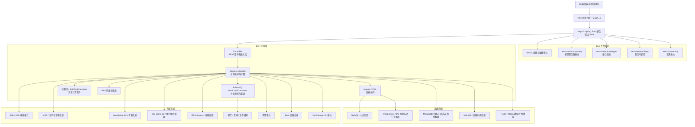
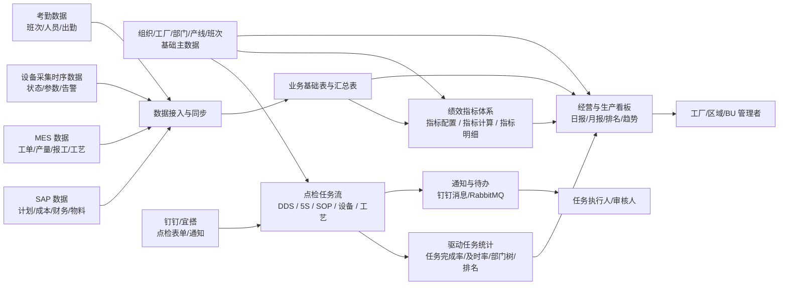
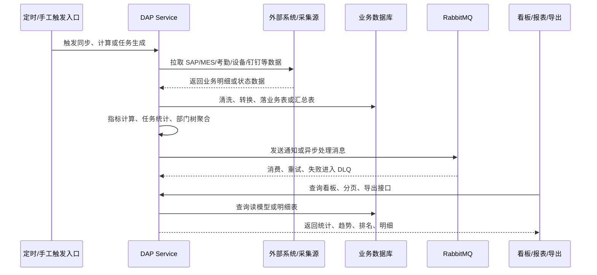

# DAP 项目总体设计文档

## 1. 文档目的

本文面向项目交接、系统维护、二次开发和生产问题排查，基于当前仓库代码结构整理 DAP 系统的总体技术架构、业务关系、数据流、模块边界和维护入口。

DAP 是 EES 体系下的数据分析与运营支撑服务，核心职责不是单一业务功能，而是把工厂生产、设备、质量、人员、任务、绩效和外部系统数据汇总到统一服务中，对上提供报表、看板、任务统计、指标计算、点检流转和通知能力。

## 2. 项目结构

当前仓库是 Maven 多模块项目：

| 模块 | 说明 | 主要内容 |
| --- | --- | --- |
| `ees-dap` | 父工程 | 管理 `dap-api`、`dap-biz` 两个子模块 |
| `dap-api` | 接口与契约模块 | DTO、VO、Entity、Enum、Feign Client、配置属性类、公共响应模型 |
| `dap-biz` | 业务实现与启动模块 | Spring Boot 启动类、Controller、Service、Mapper、定时任务、MQ、外部系统接入、MyBatis XML |

启动入口为 `dap-biz/src/main/java/com/minthgroup/ees/dap/DapApplication.java`，服务端口在 `application.yml` 中配置为 `7009`。

## 3. 系统技术架构图

## 4. 系统业务关系图

## 5. 核心业务域

| 业务域 | 主要入口 | 说明 |
| --- | --- | --- |
| 基础主数据 | `OrganizationController`、`DepartmentController`、`SiteInfoController`、`LineInfoController`、`WorkCenterController`、`ShiftInfoController` | 维护组织、工厂、部门、产线、工作中心、班次等维度数据，是指标、看板、任务流的公共维度基础 |
| 生产与设备数据 | `ProductionLineLiveController`、`EquipmentStatusMonitoringController`、`EquipmentParInfoController`、`InfluxdbController` | 汇总生产线、设备、参数、告警和时序数据，支撑实时看板、设备状态、异常分析 |
| 绩效指标 | `IndicatorCalcController`、`IndicatorDashboardController`、`IndicatorSettingController`、`IndicatorBaseInfoController` | 管理指标配置、指标计算、日结果、月归档和看板展示；当前存在质量、工艺、模具技术等计算服务 |
| 点检任务流 | `controller/taskflow/*`、`TimingTaskFlowController` | 支撑 DDS、5S、SOP、设备点检、工艺点检的基础项维护、任务生成、任务执行、异常、审核和导入导出 |
| 驱动任务统计 | `DriveTaskTimingController`、`DriveTaskSummaryController` | 从点检任务和外部待办源汇总任务完成、及时完成、区域/工厂/部门/人员排名，形成任务看板读模型 |
| 循环盘点/一致性 | `TaggedItemConsistencyController`、`TaggedItemSummaryController`、`WarehouseInventory*Controller` | 支撑标签物一致性、仓库库存、盘点任务、盘点汇总等管理能力 |
| 报表与看板 | `FactoryCommandTowerController`、`VReportController`、`GrossMarginScreenController`、`ProductionRevenueScreenController`、`buExport/BbuExportController` | 面向管理层与业务部门提供大屏、报表、导出、排名、趋势 |
| 消息通知 | `mq/*`、`MqTimingController`、`DingdingNoticeClient` | 使用 RabbitMQ 做异步消息分发、延迟重试、DLQ，并对接钉钉工作通知 |
| 外部系统集成 | `dap-api/src/main/java/.../feign/*`、`service/sap/*`、`util/*` | 对接 SAP、MES、EES、UPMS、考勤、钉钉、宜搭、EAM、告警、AI 等外部能力 |

## 6. 核心数据流

关键链路可以归纳为四类：

| 链路 | 入口 | 输出 |
| --- | --- | --- |
| 外部数据同步 | `SyncDataTimingController`、SAP/MES/考勤相关 Controller 与 Service | 主数据、生产数据、考勤数据、SAP 报表数据 |
| 指标计算 | `IndicatorCalcController` 和 `service/indicator/*` | 指标日结果、指标明细、月度归档、看板数据 |
| 点检任务生成 | `TimingTaskFlowController` 和 `Task*ServiceImpl` | DDS、5S、SOP、设备、工艺等任务表与任务组 |
| 驱动任务汇总 | `DriveTaskTimingController`、`DriveTaskSummaryService`、`handler/driveTask/*` | 驱动任务明细、PG 明细同步、日汇总读模型、排名趋势 |

## 7. 数据存储与访问边界

| 存储 | 代码证据 | 主要用途 |
| --- | --- | --- |
| MySQL / 多数据源关系库 | MyBatis-Plus、`mapper/*.java`、`resources/mapper/*.xml` | 主业务表、基础维度、报表明细、任务流、指标配置与结果 |
| PostgreSQL | `postgresql` 依赖、部分 Mapper XML 与驱动任务 PG 明细 | 部分跨系统明细、驱动任务明细读模型、外部同步表 |
| MongoDB | `spring-boot-starter-data-mongodb`、带 `@CompoundIndex` 的指标归档实体 | 指标明细归档、月结果归档、部分文档型数据 |
| InfluxDB | `InfluxDbConfig`、`InfluxDbClientService` | 设备采集参数、状态、告警、原始时序数据查询 |
| Redis | 钉钉 token 缓存、平台公共缓存 | 外部 token、临时缓存、平台通用缓存 |
| RabbitMQ | `mq/RabbitTopologyConfig`、`mq/core/Consumer` | 异步消息、钉钉通知、延迟重试、DLQ |

## 8. 外部系统关系

| 外部系统 | 接入方式 | 典型代码入口 | 业务用途 |
| --- | --- | --- | --- |
| Nacos | Spring Cloud Alibaba | `application.yml` | 服务注册、配置导入 |
| EES/UPMS | Feign | `RemoteAdminUserService`、`EesSystemService` | 用户、组织、权限、基础数据 |
| attendance-biz | Feign | `MasAttService` | 考勤、班次、出勤数据 |
| SAP | Feign / JDBC / WebService | `SapClient`、`SAPConfig`、`service/sap/*` | 计划、物料、成本、生产、质量等 SAP 数据 |
| MES | Mapper / 外部数据表 / 服务工具 | MES 相关 Controller、Mapper、XML | 工单、产线、报工、生产过程数据 |
| 钉钉/宜搭 | Feign + token 拦截器 | `DingdingClient`、`DingdingNoticeClient`、`DingdingYidaClient` | 点检表单、任务通知、工作消息 |
| EAM | Feign | `EamClient` | 设备资产、设备业务数据 |
| 告警平台 | Feign | `AlarmClient` | 告警推送或告警信息查询 |
| InfluxDB | Java Client | `InfluxDbClientService` | 设备时序数据查询与趋势分析 |
| DashScope | Feign | `DashScopeClient` | AI 问答或辅助分析能力 |

## 9. 部署与运行

### 9.1 启动配置

`dap-biz/src/main/resources/application.yml` 中定义：

| 配置 | 当前值/来源 | 说明 |
| --- | --- | --- |
| `server.port` | `7009` | DAP 服务端口 |
| `spring.application.name` | `@artifactId@` | Maven 资源过滤后通常为 `dap-biz` |
| `spring.cloud.nacos.discovery.server-addr` | `${NACOS_HOST:ees-register}:${NACOS_PORT:8848}` | Nacos 注册中心 |
| `spring.cloud.nacos.discovery.namespace` | `test` | 当前默认命名空间 |
| `spring.config.import` | `application-test.yml`、`application-cn.yml`、`${spring.application.name}-@profiles.active@.yml` | 外部配置导入 |
| `auto-table.enable` | `false` | 自动建表关闭 |
| `mybatis-plus.configuration.log-impl` | `StdOutImpl` | SQL 日志输出 |

### 9.2 Maven Profile

| Profile | 状态 | 说明 |
| --- | --- | --- |
| `cloud` | 默认启用 | 默认云环境构建，包含 Spring Boot Maven Plugin 和 Docker Maven Plugin |
| `prod` | 手动启用 | 生产构建配置，带生产 Nacos 账号属性 |
| `serbia` | 手动启用 | 塞尔维亚环境构建 |
| `boot` | 手动启用 | 基础启动 Profile |

## 10. 消息系统设计摘要

当前仓库已有独立文档 `doc/rabbit_mq_消息系统技术设计文档.md`。总体上，DAP 的消息系统采用 RabbitMQ，核心设计为：

| 能力 | 说明 |
| --- | --- |
| Dispatcher 消费模型 | Consumer 接收原始 `Message`，业务层显式反序列化和分发 |
| 手动 ACK | 成功后 `basicAck`，失败进入重试或 DLQ |
| 延迟重试 | 使用 TTL + DLX 实现，不依赖 RabbitMQ 延迟插件 |
| 重试节奏 | 30s、1m、5m、15m 等指数退避队列 |
| DLQ | 失败消息最终沉淀，作为人工补偿和审计入口 |
| 幂等控制 | 统一消息体 `MqMessage<T>`，业务 ID 用于幂等识别 |

## 11. 模块文档索引

当前 `doc/` 目录已有多个模块级设计文档，总文档与模块文档的关系如下：

| 文档 | 覆盖范围 |
| --- | --- |
| `安全点检模块设计文档.md` | DDS 安全点检 |
| `5S点检模块设计文档.md` | 5S 点检 |
| `标准作业（SOP）点检模块设计文档.md` | SOP 点检 |
| `设备点检模块设计文档.md` | 设备点检 |
| `工艺点检模块设计文档.md` | 工艺点检 |
| `循环盘点模块设计文档.md` | 循环盘点与盘点相关能力 |
| `驱动任务模块设计文档.md` | 驱动任务统计、任务完成率、日汇总读模型 |
| `绩效指标计算任务化重设计方案.md` | 指标计算任务化方案 |
| `rabbit_mq_消息系统技术设计文档.md` | RabbitMQ 消息体系 |

## 12. 维护与排障入口

| 问题类型 | 优先检查位置 |
| --- | --- |
| 服务启动失败 | `DapApplication`、`application.yml`、Nacos 配置、Profile、数据库连接配置 |
| 接口无权限或 401/403 | EES 网关、`@EnableEesResourceServer`、UPMS 权限、调用方 token |
| 数据不同步 | 对应 Timing Controller、同步 Service、外部系统 Feign/JDBC 配置、Mapper XML |
| 指标缺数或计算异常 | `IndicatorCalcController`、`service/indicator/*`、指标配置表、指标明细归档 |
| 点检任务未生成 | `TimingTaskFlowController`、`TaskflowProperty`、基础点检项、人员/班次/排除日期配置 |
| 驱动任务统计不准 | `DriveTaskTimingController`、`handler/driveTask/*`、`DriveTaskProperty`、PG 明细同步、日汇总任务 |
| 钉钉通知失败 | RabbitMQ 消费日志、`DingdingNoticeClient`、token 缓存、DLQ、钉钉应用配置 |
| 设备实时数据异常 | `InfluxDbConfig`、`InfluxDbClientService`、`spring.influx.*` 配置、measurement/bucket |
| 导出失败或 Excel 异常 | 对应 Controller 导出方法、DTO 字段、EasyExcel/FastExcel 监听器、i18n 表头配置 |
| SQL 性能问题 | Mapper XML、MyBatis-Plus Wrapper、索引、分页条件、跨库查询源 |

## 13. 后续维护建议

1. 新增业务模块时，应同时补齐 Controller、Service、Mapper、DTO/VO、权限入口、定时任务入口和模块文档。
2. 新增外部系统调用时，应把 Feign Client、认证拦截器、配置项、失败重试策略和超时策略写清楚。
3. 新增统计或指标时，应明确原始数据源、计算周期、落表模型、重算入口和导出入口。
4. 点检任务类模块应保持“基础项配置 -> 定时生成 -> 任务执行 -> 异常/审核 -> 统计汇总 -> 通知”的链路完整。
5. 驱动任务与指标看板应优先使用汇总读模型，避免看板查询直接扫明细大表。
6. RabbitMQ DLQ 应纳入生产运维巡检，失败消息需要有人工补偿、重放或作废流程。
7. 生产环境敏感配置应保留在 Nacos 或安全配置中心，不应继续在仓库中扩散明文账号、token、密钥。

