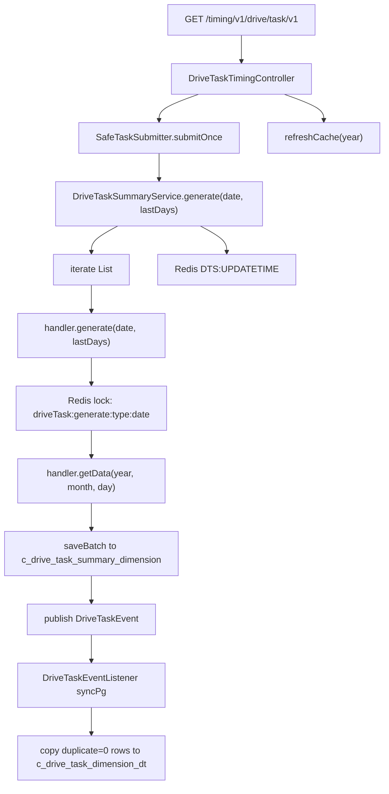
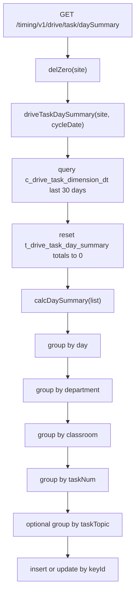

# 驱动任务模块设计文档

## 1. 文档目的

本文面向交接使用，以当前代码实现为准，说明驱动任务模块的职责边界、数据流、主要接口、统计口径、扩展方式和维护注意事项。

当前仓库中“驱动任务”不是单一的任务创建功能，而是由两部分组成：

1. `taskflow` 点检任务流：负责 DDS、5S、SOP、设备点检、工艺点检等任务的生成、待办、完成、审核、转派、关闭和通知。
2. `driveTask` 汇总统计流：负责从 `taskflow` 任务表、MES/EES/QMS 等外部待办源抽取任务数据，按日、工厂、区域、部门、课室、人员、任务类型聚合，供看板、排行、导出和绩效指标使用。

本文重点描述第二部分“驱动任务汇总统计流”，并说明它与 `taskflow` 的关系。

## 2. 模块边界

### 2.1 主要代码位置

| 类型 | 路径 | 说明 |
| --- | --- | --- |
| 定时/手工触发接口 | `dap-biz/src/main/java/com/minthgroup/ees/dap/controller/DriveTaskTimingController.java` | 生成驱动任务汇总、刷新缓存、清理数据、生成日汇总 |
| 查询/导出接口 | `dap-biz/src/main/java/com/minthgroup/ees/dap/controller/DriveTaskSummaryController.java` | 区域、工厂、部门、个人维度查询和导出 |
| 汇总服务接口 | `dap-biz/src/main/java/com/minthgroup/ees/dap/service/DriveTaskSummaryService.java` | 驱动任务汇总能力定义 |
| 汇总服务实现 | `dap-biz/src/main/java/com/minthgroup/ees/dap/service/impl/DriveTaskServiceImpl.java` | 调度各任务类型统计器、查询统计、缓存刷新、日汇总 |
| 统计器接口 | `dap-biz/src/main/java/com/minthgroup/ees/dap/handler/driveTask/DriveTaskStatistic.java` | 所有任务类型统计器统一接口 |
| 统计器抽象基类 | `dap-biz/src/main/java/com/minthgroup/ees/dap/handler/driveTask/AbstractDriveTaskStatistic.java` | 本地任务表类统计的模板方法 |
| 远程待办抽象 | `AbstractDemandDriveTaskStatistic`、`AbstractMesDriveTaskStatistic`、`AbstractQmsDriveTaskStatistic` | 从 EES/MES/QMS 等外部源拉取任务后聚合 |
| 统计器唯一性校验 | `DriveTaskStatisticValidator.java` | 启动时校验同一任务类型不能有多个统计器 |
| 数据更新事件 | `DriveTaskEvent.java`、`DriveTaskEventListener.java` | 统计完成后同步明细到 PG 数据源 |
| 日汇总服务 | `DriveTaskDaySummaryServiceImpl.java` | 把明细聚合成部门树和任务趋势读模型 |
| 任务类型枚举 | `dap-api/src/main/java/com/minthgroup/ees/dap/enums/DriveTaskTypeEnum.java` | 驱动任务类型编码 |
| 配置 | `DriveTaskProperty.java`、`application.yml` | `drivetask.sites` 和 `ees.base-info.bbu-site` |

### 2.2 与 taskflow 的关系

`taskflow` 是任务产生和业务流转层，例如：

- `/timing/taskflow/dds` 生成 DDS 点检任务。
- `/timing/taskflow/5s` 生成 5S 点检任务。
- `/timing/taskflow/sop` 生成 SOP 任务。
- `/timing/taskflow/equ` 生成设备点检任务。
- `/timing/taskflow/process` 或 `/timing/taskflow/process/order` 生成工艺点检任务。

这些任务完成后，会落在各业务任务表中，例如 `TaskDdsEntity`、`Task5sEntity`、`TaskSopAuditEntity`、`TaskEquEntity`、`TaskProcessEntity` 等。

`driveTask` 不直接负责生成这些点检任务。它负责读取这些任务结果，统一转换为驱动任务统计模型。

## 3. 核心数据模型

### 3.1 月/日明细汇总表 `c_drive_task_summary_dimension`

实体：`DriveTaskSummaryDimensionEntity`

这是 MySQL 侧的核心汇总表，由各 `DriveTaskStatistic` 统计器生成。

关键字段：

| 字段 | 含义 |
| --- | --- |
| `site`、`siteName` | 工厂编码和工厂简称 |
| `region` | 区域编码，当前代码中 `01`、`02`、`03` 分别代表不同区域，`00` 用于 BU 汇总语义 |
| `cycleDate` | 统计日期，格式为 `yyyy-MM-dd` |
| `cycleYear`、`cycleMonth` | 统计年、月 |
| `userId`、`userName` | 任务执行人 |
| `department`、`departmentName` | 部门 |
| `classroom`、`classroomName` | 课室 |
| `line` | 产线，部分 MES 类统计使用 |
| `taskNum`、`taskName` | 驱动任务类型编码和名称 |
| `taskTopic` | 任务主题，部分任务支持更细粒度统计 |
| `total` | 任务总数 |
| `completedCount` | 完成任务数 |
| `onTimeCompletionCount` | 及时完成任务数 |
| `completionRate` | 完成率，部分查询中动态计算 |
| `duplicate` | 去重标识，`0` 为默认去重后数据，`1` 为未去重或特殊保留明细 |
| `businessId` | 业务来源 ID |

### 3.2 PG 明细表 `c_drive_task_dimension_dt`

实体：`DriveTaskDimensionDtEntity`

这是 `DriveTaskEventListener` 同步到 `mas-pg` 数据源的明细表。它从 `c_drive_task_summary_dimension` 中筛选指定 `site + cycleDate + taskNum + duplicate = 0` 的数据后复制过去。

区域、工厂维度看板和部分导出主要读取该表：

- `DriveTaskSummaryDimensionDtMapper#getTotalByRegion`
- `getCompletedByRegion`
- `getOnTimeCompletedByRegion`
- `completionRates`
- `completionRatesByCycleDate`
- `selectBuTaskCompletionRanking`
- `selectTaskCompletionRanking`

### 3.3 日汇总读模型 `t_drive_task_day_summary`

实体：`DriveTaskDaySummaryEntity`

这是部门看板树和趋势统计使用的日级读模型，由 `DriveTaskDaySummaryServiceImpl#calcDaySummary` 从 `c_drive_task_dimension_dt` 近 30 天明细聚合生成。

关键字段：

| 字段 | 含义 |
| --- | --- |
| `site` | 工厂 |
| `cycleDate` | 日期 |
| `department`、`departmentName` | 部门 |
| `classroom`、`classroomName` | 课室 |
| `taskNum` | 任务类型，汇总节点使用 `ALL` |
| `taskTopic` | 任务主题，汇总节点使用 `ALL` |
| `granularity` | 粒度，`2` 部门，`1` 课室，`0` 任务类型，`3` 任务主题 |
| `pid`、`keyId` | 树结构父子关系 |
| `total`、`completedCount`、`onTimeCompletionCount` | 总数、完成数、及时完成数 |
| `completionRate`、`onTimeCompletionRate` | 查询阶段动态或聚合计算出的完成率 |

`keyId` 生成规则见 `DriveTaskDaySummaryServiceImpl#getKey`：

- 有 `taskTopic`：`cycleDate:site:department:classroom:taskNum:taskTopic`
- 无 `taskTopic`：`cycleDate:site:department:classroom:taskNum`

查询树时会通过 `summaryList2Map` 去掉日期前缀，把多天数据聚合成同一部门、课室、任务节点。

## 4. 任务类型

任务类型定义在 `DriveTaskTypeEnum`，当前支持的编码包括：

| 编码 | 枚举 | 来源或含义 |
| --- | --- | --- |
| `ned` | `T_NED` | 需求任务 |
| `dds` | `T_DDS` | DDS 点检 |
| `5s` | `T_5s` | 5S 点检 |
| `sop` | `T_SOP` | 标准作业观察 |
| `equ` | `T_EQU` | 设备点检 |
| `pce` | `T_PCE` | 工艺点检 |
| `exc` | `T_EXC` | 异常处理响应任务 |
| `eequ` | `T_EAM_EQU` | EAM 设备点检任务 |
| `bpc` | `T_BPC` | 备品备件更换任务 |
| `mck1` | `T_MES_CK_1` | MES 制程检验 |
| `mck2` | `T_MES_CK_2` | MES 生产 4M 变化 |
| `mck3` | `T_MES_CK_3` | MES 实验室检验 |
| `qms1` 至 `qms5` | `T_QMS_1` 至 `T_QMS_5` | QMS 相关计划和任务 |
| `tic` | `T_TIC` | 循环盘点任务 |
| `trp`、`pcp`、`jpd` | TOP 类任务 | 当前枚举存在，统计器实现需按代码确认 |

注意：当前源码中部分中文枚举名称存在编码显示问题，交接和排查时以 `code`、枚举名、统计器类名为准。

## 5. 总体处理流程

### 5.1 定时汇总流程

主要入口：`GET /timing/v1/drive/task/v1`

参数：

- `cycleDate`：可选，格式 `yyyy-MM-dd`。为空时使用当前日期。
- `lastDays`：可选，默认 `3`。生成 `cycleDate - lastDays` 到 `cycleDate` 的数据。

流程：



当前实现的关键点：

- `DriveTaskServiceImpl#generate(LocalDate, Integer)` 遍历 Spring 注入的 `List<DriveTaskStatistic>`，每个统计器独立执行。
- 单个统计器失败只记录日志，不阻断其他统计器。
- `AbstractDriveTaskStatistic#generate(date, lastDays)` 对每一天加 Redis 锁，锁 key 为 `driveTask:generate:{taskType}:{date}`。
- 每天、每类型统计完成后发布 `DriveTaskEvent`。
- `DriveTaskEventListener` 异步同步 PG 明细。
- `generate` 结束后写入 Redis `DTS:UPDATETIME`，保留 30 天。
- Controller 随后刷新区域和工厂看板缓存。

### 5.2 单类型汇总流程

入口：

- `GET /timing/v1/drive/task/type`
- `GET /timing/v1/drive/task/type/v1`

区别：

- `/type` 的 `cycleDate` 按 `yyyy-MM` 解析，并补为每月 1 号，然后统计整月。
- `/type/v1` 的 `cycleDate` 按 `yyyy-MM-dd` 解析，并支持 `lastDays`。

服务方法：

- `DriveTaskSummaryService#generate(LocalDate date, DriveTaskTypeEnum type)`
- `DriveTaskSummaryService#generate(LocalDate date, DriveTaskTypeEnum type, Integer lastDays)`

该流程只执行匹配 `DriveTaskTypeEnum` 的一个统计器。

### 5.3 日汇总流程

入口：`GET /timing/v1/drive/task/daySummary`

参数：

- `site`：必填。
- `cycleDate`：可选，默认当前日期。

流程：



当前实现的过滤条件：

- `site = {site}`
- `cycleDate >= today.minusDays(29)`
- `total > 0`
- `cycleDate`、`taskNum`、`department`、`classroom` 非空

更新策略：

1. 先把 `t_drive_task_day_summary` 中该站点近 30 天总数、完成数、及时完成数置 0。
2. 再按 `keyId` 判断新增或更新。

### 5.4 查询流程

查询入口集中在 `DriveTaskSummaryController`，路径前缀为 `/drive/task`。

| 接口 | 说明 | 主要读取 |
| --- | --- | --- |
| `GET /region/statistics` | 区域任务完成率 | Redis 缓存或 PG 明细 |
| `GET /site/statistics` | 工厂任务完成率 | Redis 缓存或 PG 明细 |
| `GET /ranking` | BU/区域任务类型排行 | PG 明细 |
| `GET /site/ranking` | 工厂任务类型排行 | MySQL 汇总 |
| `GET /types` | 任务类型列表 | `DriveTaskTypeEnum.list()` |
| `POST /dept/driverTask/summaryTree` | 部门任务完成率树 | `t_drive_task_day_summary` |
| `POST /dept/driverTask/summaryStatics` | 部门任务统计和趋势 | `t_drive_task_day_summary` |
| `GET /dept/month/completionRates` | 部门月或日趋势 | MySQL 汇总 |
| `GET /dept/ranking` | 部门下任务排行 | MySQL 汇总 |
| `GET /dept/personal/ranking` | 个人完成率排行 | PG 明细并过滤在职人员 |
| 多个 `/export...` | 导出 | MySQL 或 PG 汇总，视接口而定 |

## 6. 统计器设计

### 6.1 统一接口

所有统计器实现 `DriveTaskStatistic`：

```java
public interface DriveTaskStatistic {
    DriveTaskTypeEnum getTaskType();

    void generate(LocalDate date);

    void generate(LocalDate date, Integer lastDays);
}
```

启动时 `DriveTaskStatisticValidator#afterPropertiesSet` 会遍历所有统计器，调用 `getTaskType()`，并校验同一个 `DriveTaskTypeEnum` 不能被多个实现类重复使用。

### 6.2 本地任务表类统计器

继承 `AbstractDriveTaskStatistic` 的本地统计器使用模板方法：

1. 子类设置任务类型：`setTaskType()`。
2. 子类实现三类查询：
   - `listTaskTotal(queryCycleDate)`
   - `listTaskCompletedCount(queryCycleDate)`
   - `listOnTimeTaskCompletedCount(queryCycleDate)`
3. 抽象基类按 `site + department + classroom + userId` 合并总数、完成数、及时完成数。
4. 抽象基类补齐 `taskNum`、`taskName`、`region`、`cycleDate`、`cycleYear`、`cycleMonth`、`siteName`。
5. 子类可通过 `afterDealTaskCount` 做额外字段修正。
6. `saveBatch` 先删除同一天同类型旧数据，再批量写入新数据。

典型实现：

- `DdsDriveTaskStatistic`
- `T5sDriveTaskStatistic`
- `SopDriveTaskStatistic`
- `EquDriveTaskStatistic`
- `PceDriveTaskStatistic`
- `TicDriveTaskStatistic`

### 6.3 远程 EES 待办类统计器

`AbstractDemandDriveTaskStatistic` 适用于从 EES 待办接口分页拉取数据的任务类型。

关键逻辑：

- 使用 `eesSystemService.demandList(cycleDate, source, lastId)` 分页拉取。
- 过滤状态 `3`、`4`。
- 以 `executorCode` 为 key 聚合。
- 通过 `SyncEmpMapper#getEmpByEmpIdAllSite` 补齐人员、工厂、部门和课室。
- 状态 `2` 计为完成。
- `finishTime <= planFinishTime` 或无计划完成时间时计为及时完成。

典型实现：

- `NedDriveTaskStatistic`
- `BpcDriveTaskStatistic`

### 6.4 MES 类统计器

`AbstractMesDriveTaskStatistic` 从 `MesProcessInfoMapper#getMesCycleDateProcessInfoByCategory` 获取 MES 任务。

关键逻辑：

- 工厂范围来自 `drivetask.sites`，未配置时默认 `2871`。
- 子类提供 MES 类别：`getCategory()`。
- 以执行人工号聚合。
- 通过 `getUserAllSite` 补齐人员所属站点和组织。
- 状态 `2` 计为完成。
- `finishTime <= planFinishTime` 计为及时完成。

典型实现：

- `Mck1DriveTaskStatistic`
- `Mck2DriveTaskStatistic`
- `Mck3DriveTaskStatistic`

### 6.5 QMS 类统计器

`AbstractQmsDriveTaskStatistic` 从 `eesSystemService.demandQmsList` 获取 QMS 任务。

关键逻辑：

- 使用配置 `ees.base-info.bbu-site` 的第一个站点调用远程接口。
- 任务实际站点来自 `DemandEntity#remark`。
- 只统计 `drivetask.sites` 启用站点。
- 过滤状态 `4`。
- 状态 `2` 计为完成。
- 人员组织为空时，代码会用 `TEMP0001` 作为兜底部门或课室。

典型实现：

- `Qms1DriveTaskStatistic`
- `Qms2DriveTaskStatistic`
- `Qms3DriveTaskStatistic`
- `Qms4DriveTaskStatistic`
- `Qms5DriveTaskStatistic`

### 6.6 扩展新任务类型

新增任务类型的代码步骤：

1. 在 `DriveTaskTypeEnum` 新增枚举值，配置唯一 `code`。
2. 新增一个 `DriveTaskStatistic` Bean。
3. 若数据来自本地任务表，继承 `AbstractDriveTaskStatistic` 并实现三类查询。
4. 若数据来自 EES 待办，优先继承 `AbstractDemandDriveTaskStatistic`。
5. 若数据来自 MES，优先继承 `AbstractMesDriveTaskStatistic`。
6. 若数据来自 QMS，优先继承 `AbstractQmsDriveTaskStatistic`。
7. 确认 `DriveTaskStatisticValidator` 启动无重复类型异常。
8. 手工调用 `/timing/v1/drive/task/type/v1?type=...` 验证生成。
9. 确认 `c_drive_task_summary_dimension` 和 `c_drive_task_dimension_dt` 均有数据。
10. 若需要部门看板，调用 `/timing/v1/drive/task/daySummary?site=...` 生成日汇总。

## 7. 接口设计明细

### 7.1 定时接口 `/timing/v1`

| 方法 | 路径 | 说明 |
| --- | --- | --- |
| `GET` | `/drive/task/daySummary` | 生成某站点近 30 天日汇总 |
| `GET` | `/drive/task/type` | 按月生成单个任务类型汇总 |
| `GET` | `/drive/task/v1` | 按日期窗口生成所有任务类型汇总 |
| `GET` | `/drive/task/type/v1` | 按日期窗口生成单个任务类型汇总 |
| `GET` | `/drive/task/clean/type` | 清理某月、某站点、某类型数据 |
| `GET` | `/drive/task/refreshCache` | 刷新区域和工厂统计缓存 |
| `DELETE` | `/drive/task/delNoRegin` | 删除无区域数据，仅当 `bbuSites == 2871` 时执行 |
| `GET` | `/drive/task/getUpdateTime` | 获取最近生成时间 |
| `GET` | `/drive/task/site/statistics` | 获取单工厂年度统计 |
| `DELETE` | `/drive/task/del/daySummary` | 删除某站点某天日汇总 |

维护注意：

- 大多数定时接口标记了 `@NoToken`，并且 `@Inner(false)`，需要依赖网关、调度系统或部署网络边界控制访问。
- `/drive/task/v1` 使用 `SafeTaskSubmitter.submitOnce`，再叠加 Redis 锁避免重复执行。
- `/drive/task/type/v1` 当前是同步执行，没有 `submitOnce` 包裹，调用方需要注意接口耗时。

### 7.2 查询接口 `/drive/task`

| 方法 | 路径 | 说明 |
| --- | --- | --- |
| `GET` | `/region/statistics` | 区域完成率 |
| `GET` | `/export` | 区域完成率导出 |
| `GET` | `/export/dt` | 区域完成率明细导出 |
| `GET` | `/exportBySite` | 工厂完成率导出 |
| `GET` | `/export/dtBySite` | 工厂完成率明细导出 |
| `GET` | `/ranking` | BU 或区域任务排行 |
| `GET` | `/site/statistics` | 区域下工厂完成率 |
| `GET` | `/site/ranking` | 工厂任务排行 |
| `GET` | `/types` | 驱动任务类型列表 |
| `POST` | `/dept/driverTask/summaryTree` | 部门树 |
| `POST` | `/dept/driverTask/summaryStatics` | 部门统计卡片和趋势 |
| `GET` | `/export/dept/completionRates` | 部门完成率导出 |
| `GET` | `/export/dept/completionRates/dt` | 部门完成率明细导出 |
| `GET` | `/dept/month/completionRates` | 部门月或日趋势 |
| `GET` | `/dept/ranking` | 部门任务排行 |
| `GET` | `/export/dept/ranking` | 部门任务排行导出 |
| `GET` | `/export/dept/ranking/dt` | 部门任务排行明细导出 |
| `GET` | `/dept/personal/ranking` | 个人排行 |
| `GET` | `/export/dept/personal/ranking` | 个人排行导出 |
| `GET` | `/export/dept/personal/ranking/dt` | 个人排行明细导出 |

## 8. 统计口径

### 8.1 基础口径

完成率：

```text
completionRate = completedCount / total * 100
```

及时完成率：

```text
onTimeCompletionRate = onTimeCompletionCount / total * 100
```

不同查询位置有不同取整方式：

- `DriveTaskServiceImpl#calcRate` 使用 `Math.round` 返回整数。
- 部分 Mapper SQL 使用 `ROUND`。
- 部分排名 SQL 使用 `FLOOR`。
- `calcPercent` 保留两位百分比语义，但实际实现为 `calcRateDouble + "%"`.

交接维护时，如果业务要求统一小数位或四舍五入规则，需要同时检查 Java 计算和 Mapper SQL。

### 8.2 任务完成状态

本地 `taskflow` 类统计一般由各 Mapper 决定完成状态口径。

远程待办类、MES 类、QMS 类的公共口径是：

- 状态 `2` 计为完成。
- EES/QMS 状态 `3`、`4` 或 `4` 会在不同抽象类中过滤。
- `finishTime` 不晚于 `planFinishTime` 计为及时完成。
- `planFinishTime == null` 时，完成任务会被视为及时完成。

### 8.3 区域和工厂名

区域来自 `AreaSiteEntity`：

- 工厂编码查询 `area_site` 相关表。
- `area` 中文名称映射为 `01`、`02`、`03`。
- 工厂简称通过 `site_abb` 查询，并缓存到 Redis。

当前源码中区域中文名称存在编码显示问题，但逻辑依赖字符串匹配。维护区域映射时应优先检查 `AbstractDriveTaskStatistic#queryRegion`。

### 8.4 去重标识

多数统计和看板只使用 `duplicate = '0'` 的数据。

特殊情况：

- `deptCompletionRatesByCycleDate`、`deptPersonalCompletionRatesByCycleDate` 查询会读取 `duplicate in ('0','1')`。
- 导出排行明细时，MES `mck1`、`mck2`、`mck3` 存在额外过滤逻辑：某些情况下会跳过 `duplicate = '0'` 的行。

维护 MES 类明细时，需要单独确认 `Mck1DriveTaskStatistic`、`Mck3DriveTaskStatistic` 中的去重逻辑和 `businessId` 语义。

## 9. 缓存和锁

### 9.1 Redis 缓存

| Key | 说明 |
| --- | --- |
| `DTS:UPDATETIME` | 最近驱动任务生成时间 |
| `DTS:BU:{year}` | BU/区域统计缓存 |
| `DTS:BU:{year}:{taskNum}` | 指定任务类型 BU/区域统计缓存 |
| `DTS:REGION:SITE1{year}:{site}` | 工厂年度统计缓存 |
| `DTS:REGION:{site}` | 工厂区域缓存 |
| `DTS:SITENAME:{site}` | 工厂简称缓存 |
| `DTS:EMP:{site}{userId}` | 员工信息缓存 |
| `DTS:EMP:{userId}` | 跨站点员工信息缓存 |
| `DTS:LEND2:{site}:{month}` | 借调人员部门信息缓存 |

### 9.2 Redis 锁

| 锁 | 使用位置 | 作用 |
| --- | --- | --- |
| `driveTask:{bbuSites}:{date}:{lastDays}` | `/drive/task/v1` | 避免全量窗口重复提交 |
| `driveTask:generate:{taskType}:{date}` | `AbstractDriveTaskStatistic` | 避免同类型同日期重复生成 |
| `PUBLIC_LOCK:SYNC-PG:{site}:{cycleDate}:{taskNum}` | `DriveTaskEventListener` | 避免 PG 明细重复同步 |
| `driveTask:daySummary{site}:{cycleDate}` | `/drive/task/daySummary` | 避免日汇总重复提交 |
| `clean:zero:{site}` | `DriveTaskServiceImpl#delZero` | 避免并发清理零值日汇总 |
| `driveTask:refreshCache:{bbuSites}:{date}` | `/drive/task/refreshCache` | 避免缓存重复刷新 |

## 10. 数据一致性策略

### 10.1 汇总重算

`AbstractDriveTaskStatistic#saveBatch(year, month, day, saveList)` 的策略是：

1. 删除 `cycleDate + taskNum` 对应的旧数据。
2. 过滤 `site` 为空或 `region` 为空的数据。
3. 重新生成 ID。
4. 批量保存。

该策略保证同一日期、同一任务类型重复执行时，MySQL 汇总表具备重算语义。

### 10.2 PG 同步

PG 同步由事件异步触发：

1. 查询 MySQL `c_drive_task_summary_dimension` 中 `site + cycleDate + taskNum + duplicate = '0'` 的数据。
2. 删除 PG `c_drive_task_dimension_dt` 中同 `site + cycleDate + taskNum` 的旧数据。
3. 复制属性后批量写入 PG。
4. 捕获 `PersistenceException` 并记录重复主键警告。

风险点：

- 事件异步执行，MySQL 生成成功不代表 PG 已经同步完成。
- `DriveTaskEventListener` 对每个 `bbuSites` 都尝试同步，但 MySQL 查询条件包含 `site`，无数据则跳过。
- PG 同步异常只记录日志，调用 `/drive/task/v1` 的 HTTP 响应仍是 `R.ok()`。

### 10.3 日汇总重算

日汇总不是由 `DriveTaskEvent` 自动触发，而是通过 `/timing/v1/drive/task/daySummary` 独立触发。

所以完整刷新一个站点看板通常需要：

1. 调用 `/timing/v1/drive/task/v1` 生成任务明细并同步 PG。
2. 等待或确认 PG 同步完成。
3. 调用 `/timing/v1/drive/task/daySummary?site=...` 生成部门树读模型。

## 11. 外部依赖

| 依赖 | 用途 |
| --- | --- |
| Redis | 分布式锁、统计缓存、员工/工厂/区域缓存、更新时间记录 |
| MySQL 默认数据源 | `c_drive_task_summary_dimension`、`taskflow` 业务表、员工和区域基础数据 |
| `mas-pg` 数据源 | `c_drive_task_dimension_dt` |
| `EesSystemService` | EES 待办、QMS 待办 |
| `MesProcessInfoMapper` | MES 任务来源 |
| `SyncEmpMapper` | 员工、组织、借调部门补齐 |
| `AreaSiteMapper` / `AreaSiteService` | 工厂简称、区域、公司编码 |
| `SafeTaskSubmitter` | 异步任务提交和去重包装 |

## 12. 配置项

### 12.1 `ees.base-info.bbu-site`

多个入口和服务使用该配置作为当前部署实例处理的站点集合。

默认值在代码中多处出现：

```text
2871,2071,2073,2951,3341,3511,2911,2881,3321,3271,2081
```

影响范围：

- `/timing/v1/drive/task/v1` 的锁粒度和缓存刷新。
- `DriveTaskEventListener` 同步 PG 时遍历站点。
- `refreshCache` 刷新哪些站点的统计缓存。
- `TimingTaskFlowController` 中点检任务生成范围。

### 12.2 `drivetask.sites`

配置实体：`DriveTaskProperty`

用途：

- 控制 MES/QMS 等部分远程任务统计的启用站点。
- 若未配置，`AbstractDriveTaskStatistic#getEnableSiteList` 默认返回 `2871`。

维护注意：如果某个站点在 `ees.base-info.bbu-site` 中，但不在 `drivetask.sites` 中，部分远程任务类型可能不会被统计。

## 13. 与绩效指标的关系

驱动任务统计会被绩效指标引用。

例如 `IndicatorCalculatorD019ServiceImpl` 注入 `DriveTaskDimensionDtService`，通过 `getListByUserId(userId, site, cycleDate)` 获取用户维度驱动任务明细，用于计算任务完成率类指标。

因此驱动任务数据链路如果中断，会影响：

- 驱动任务看板。
- 区域、工厂、部门、个人排行。
- 任务完成率相关绩效指标。
- 明细导出。

## 14. 维护和排查指南

### 14.1 某任务类型没有数据

排查顺序：

1. 确认 `DriveTaskTypeEnum` 中存在对应 code。
2. 确认存在唯一的 `DriveTaskStatistic` 实现类，启动时没有 `DriveTaskStatisticValidator` 异常。
3. 手工调用 `/timing/v1/drive/task/type/v1?type={type}&cycleDate={date}&lastDays=0`。
4. 查 `c_drive_task_summary_dimension` 是否有 `cycle_date = date`、`task_num = type` 数据。
5. 如果 MySQL 有数据但区域看板无数据，查 `c_drive_task_dimension_dt` 是否同步成功。
6. 如果 PG 无数据，查 `DriveTaskEventListener#syncPg` 日志和 `PUBLIC_LOCK:SYNC-PG` 锁。
7. 如果日汇总看板无数据，调用 `/timing/v1/drive/task/daySummary?site={site}&cycleDate={date}`。
8. 查 `t_drive_task_day_summary` 是否生成对应站点近 30 天数据。

### 14.2 统计数明显偏少

重点检查：

- `site` 是否在 `drivetask.sites`。
- `region` 是否能从 `AreaSiteEntity` 正确映射。
- 人员信息是否能通过 `SyncEmpMapper` 查到。
- `department`、`classroom` 是否为空，日汇总会过滤空部门或空课室明细。
- 是否被 `duplicate = '0'` 过滤。
- 远程待办状态是否被 `3`、`4` 或 `4` 过滤。

### 14.3 部门树缺节点

重点检查：

- `t_drive_task_day_summary` 是否有近 30 天数据。
- `granularity` 是否为 `2`、`1`、`0`、`3`。
- `keyId` 是否符合 `cycleDate:site:department:classroom:taskNum[:taskTopic]`。
- `summaryList2Map` 会把 `keyId.substring(11)` 作为跨日期聚合 key，因此 `cycleDate` 必须是标准 `yyyy-MM-dd` 长度。
- 如果父节点不存在，代码会把节点 `pid` 改为 `0`。

### 14.4 缓存数据不更新

处理方式：

1. 调用 `/timing/v1/drive/task/refreshCache`。
2. 查询 `/timing/v1/drive/task/getUpdateTime`。
3. 检查 Redis key `DTS:BU:{year}`、`DTS:REGION:SITE1{year}:{site}`。
4. 如果仍不一致，直接查 `c_drive_task_dimension_dt` 判断是缓存问题还是 PG 明细问题。

### 14.5 接口返回成功但数据没变

当前定时接口多为异步提交，`R.ok()` 只代表提交成功，不代表统计全部完成。

需要看：

- `SafeTaskSubmitter` 是否拒绝了重复提交。
- Redis 锁是否被占用。
- 统计器内部是否捕获异常并继续。
- `DriveTaskServiceImpl#generate` 中对应 handler 的错误日志。
- `DriveTaskEventListener` 的 PG 同步日志。

## 15. 当前实现的注意点和风险

1. 中文注释和枚举名称在部分文件中显示为乱码，维护时以英文类名、方法名、字段名和枚举 `code` 为准。
2. `/timing/v1/drive/task/v1` 是异步执行，接口成功不等于数据已刷新完成。
3. `/timing/v1/drive/task/type/v1` 是同步执行，统计范围过大时可能阻塞请求线程。
4. MySQL 汇总表和 PG 明细表之间通过事件异步同步，存在短暂延迟和失败后只记日志的问题。
5. `t_drive_task_day_summary` 需要单独触发生成，不会在 PG 同步后自动刷新。
6. 区域映射依赖 `AreaSiteEntity#area` 的中文字符串匹配，编码或基础数据变化会导致 `region` 为空，进而被过滤。
7. 部门树查询通过 `keyId.substring(11)` 去掉日期前缀，隐含要求日期格式固定为 10 位 `yyyy-MM-dd`。
8. 完成率取整规则分散在 Java 和 SQL 中，排行、导出、看板可能存在小数处理差异。
9. 部分 SQL 中站点列表是硬编码的，例如 PG mapper 中 `site in (...)`，新增站点时需要同步维护。
10. 部分接口使用 `@NoToken`，需要从部署和网关层保证安全边界。

## 16. 建议交接清单

接手人员需要重点熟悉以下入口：

1. 生成所有驱动任务汇总：`GET /timing/v1/drive/task/v1?cycleDate=yyyy-MM-dd&lastDays=3`
2. 生成单类型汇总：`GET /timing/v1/drive/task/type/v1?cycleDate=yyyy-MM-dd&type=dds&lastDays=0`
3. 生成部门日汇总：`GET /timing/v1/drive/task/daySummary?site=2871&cycleDate=yyyy-MM-dd`
4. 刷新缓存：`GET /timing/v1/drive/task/refreshCache`
5. 查询更新时间：`GET /timing/v1/drive/task/getUpdateTime`
6. 部门树查询：`POST /drive/task/dept/driverTask/summaryTree`
7. 部门统计查询：`POST /drive/task/dept/driverTask/summaryStatics`

接手人员需要重点关注以下表：

1. `c_drive_task_summary_dimension`
2. `c_drive_task_dimension_dt`
3. `t_drive_task_day_summary`
4. `taskflow` 下各任务业务表
5. 工厂区域基础数据表，对应 `AreaSiteEntity`

接手人员需要重点关注以下类：

1. `DriveTaskTimingController`
2. `DriveTaskSummaryController`
3. `DriveTaskServiceImpl`
4. `AbstractDriveTaskStatistic`
5. `DriveTaskEventListener`
6. `DriveTaskDaySummaryServiceImpl`
7. 各具体 `*DriveTaskStatistic`
8. `TimingTaskFlowController`
9. `TaskGroupServiceImpl`

## 17. 总结

当前驱动任务模块的核心设计是“任务产生”和“任务统计”分离：

- `taskflow` 负责生成和流转真实点检任务。
- `driveTask` 负责把本地任务表和外部待办统一聚合成标准统计模型。
- `c_drive_task_summary_dimension` 是 MySQL 侧重算结果。
- `c_drive_task_dimension_dt` 是 PG 侧明细读模型。
- `t_drive_task_day_summary` 是部门树和趋势看板读模型。

扩展新任务类型时，应优先复用现有统计器抽象，只补充数据来源和任务类型映射。排查问题时，应按“生成 MySQL 汇总 -> 同步 PG 明细 -> 生成日汇总 -> 查询缓存/看板”的顺序定位。
